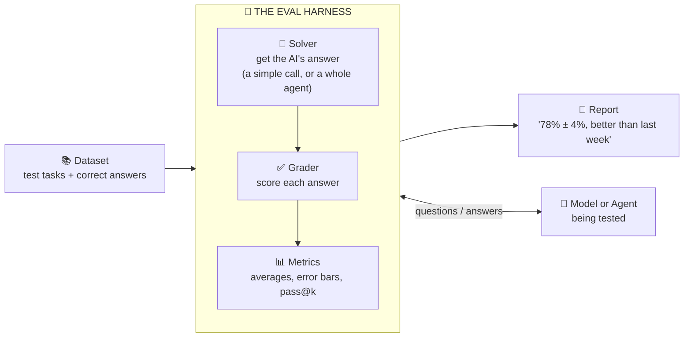
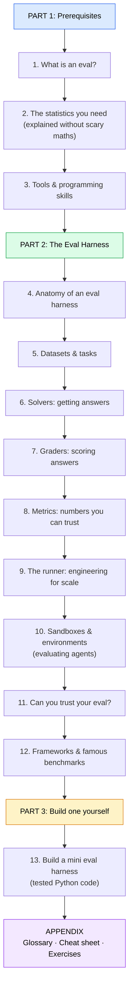

# Eval Harness: How to Measure AI, From Zero

Written with Claude as a study guide.

This guide teaches you how to build an **evaluation harness**: the software that tests AI models and AI agents and tells you, with numbers you can trust, how good they are. It starts from the basics, uses plain English, and has diagrams everywhere.

It's the companion to **[harness-learning](https://github.com/Dakuaisu/harness-learning)**, which teaches *agent* harnesses (the software that lets an AI *do* things). This guide teaches the software that *grades* them.

> **The one-sentence version:**
> An eval harness is a program that gives an AI a set of test tasks, collects its answers, **scores** them automatically, and turns the scores into **trustworthy numbers**: how good is it, how sure are we, and is version B really better than version A?

---

## 🗺️ Your learning path

## 📚 Table of contents

### Part 1: Prerequisites
| # | Chapter | What you'll learn |
|---|---------|-------------------|
| 1 | [What is an eval?](part-1-prerequisites/01-what-is-an-eval.md) | Evals, benchmarks, graders, and why "it looks good to me" isn't enough |
| 2 | [The statistics you need](part-1-prerequisites/02-statistics-you-need.md) | Averages, spread, error bars, and why one run proves nothing |
| 3 | [Tools & skills](part-1-prerequisites/03-tools-and-skills.md) | JSONL, subprocesses, concurrency, Docker, pytest, and the agent-harness basics |

### Part 2: The Eval Harness
| # | Chapter | What you'll learn |
|---|---------|-------------------|
| 4 | [Anatomy of an eval harness](part-2-eval-harness/04-anatomy.md) | The five parts, and how an eval harness wraps an agent harness |
| 5 | [Datasets & tasks](part-2-eval-harness/05-datasets-and-tasks.md) | Writing good test cases, and the many ways they go wrong |
| 6 | [Solvers](part-2-eval-harness/06-solvers.md) | Getting the AI's answer: single calls, agents, and settings that matter |
| 7 | [Graders](part-2-eval-harness/07-graders.md) | Exact match, code tests, end-state checks, LLM judges, humans |
| 8 | [Metrics](part-2-eval-harness/08-metrics.md) | Error bars, pass@k, pass^k, comparing two systems fairly |
| 9 | [The runner](part-2-eval-harness/09-the-runner.md) | Parallelism, retries, resuming, logging, keeping errors out of scores |
| 10 | [Sandboxes & environments](part-2-eval-harness/10-sandboxes-and-environments.md) | Evaluating agents safely: fresh worlds, mock APIs, hidden tests |
| 11 | [Can you trust your eval?](part-2-eval-harness/11-trust-your-eval.md) | Oracle and null checks, reading transcripts, contamination, reward hacking |
| 12 | [Frameworks & benchmarks](part-2-eval-harness/12-frameworks-and-benchmarks.md) | Inspect, lm-eval-harness, SWE-bench, WildClawBench, and when to build your own |

### Part 3: Build one
| # | Chapter | What you'll learn |
|---|---------|-------------------|
| 13 | [Build your own mini eval harness](part-3-build/13-build-your-own.md) | A working, tested eval harness, explained part by part ([code](part-3-build/code/mini_eval.py)) |

### Appendix
- [Glossary](appendix/glossary.md): every term in plain English
- [Cheat sheet](appendix/cheat-sheet.md): the whole guide on one page
- [Exercises & next steps](appendix/exercises-and-next-steps.md): practice projects from easy to hard

---

## 💡 How to read this guide

- **New to AI agents?** Read at least Chapters 2, 3, 6 and 7 of the [agent harness guide](https://github.com/Dakuaisu/harness-learning) first. Chapter 3 here tells you exactly what you need from it.
- **Diagrams** are [Mermaid](https://mermaid.js.org/) flowcharts, which GitHub draws automatically.
- **Code** is Python. Part 3's harness is fully runnable and has its own test suite. Its sanity checks run **without an API key**.
- **"🔑 Key idea"** boxes mark the sentences to remember. **"🧪 Try it"** boxes are small exercises.

Start here → [Chapter 1: What is an eval?](part-1-prerequisites/01-what-is-an-eval.md)
