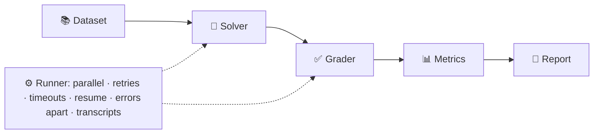

# Cheat Sheet: Eval Harnesses on One Page

[← Contents](../README.md)

## The pipeline



## The ten commandments of evals

1. **Test the eval first**: oracle ≈ 100%, null ≈ 0%.
2. **Evaluate what you ship**: same prompt, tools, model, settings.
3. **Hide the answers**: ground truth unreachable; tests added after the agent stops.
4. **Fresh world per trial**: no leftover state.
5. **Grade outcomes, not paths**; for agents, **grade the end state**.
6. **Errors aren't wrong answers**: plumbing failures go in `errors.jsonl`.
7. **Truncated isn't wrong**: excluded from averages; fix `max_tokens`.
8. **Always show error bars**: mean ± 95% CI, over samples, with reps averaged first.
9. **Compare paired**: same samples; if the CI of the difference includes 0, you can't tell.
10. **Read the transcripts**: failures *and* successes.

## Graders: cheapest that truly works

| Output | Grader |
|--------|--------|
| number / label / name | normalised exact match, numeric tolerance, regex |
| code | hidden unit tests (with a timeout) |
| agent actions | end-state checks in the sandbox + hidden tests |
| open-ended text | LLM judge: concrete yes/no rubric, structured output, different model, calibrated |
| deep expertise | humans |

## Formulas

```
mean ± 1.96 × SD/√n            95% confidence interval
≈ 1/√(n × reps)                rough noise floor for a paired pass-rate difference
pass@k = 1 − C(n−c,k)/C(n,k)   any of k tries succeeds (capability)
pass^k = C(c,k)/C(n,k)         all k tries succeed (reliability)
precision = TP/(TP+FP)   recall = TP/(TP+FN)
```

## Statuses

| Status | In results? | In the average? |
|--------|------------|-----------------|
| ok | ✅ | ✅ |
| refusal | ✅ | ✅ (and counted separately) |
| step_limit | ✅ | ✅ (a failure) |
| truncated | ✅ | ❌ |
| api_error / timeout / model_mismatch / harness_error | ❌ errors.jsonl | ❌ |

## A good dataset is...

unambiguous · correctly labelled · solvable (reference passes) · tests skill not memory · realistic · both-directions · balanced · useful difficulty · uncontaminated · split dev/test · versioned

## LLM judge defences

randomise A/B order · don't reward length · don't judge yourself · hide which is the "reference" · treat the answer as data · concrete criteria · structured output · calibrate against humans · must fail on empty, "I don't know", and off-topic answers

## Every run records

`config.json` (model, effort, settings, dataset hash, harness version) · `results.jsonl` · `errors.jsonl` · `traces/` · `report.md`

[← Contents](../README.md)
