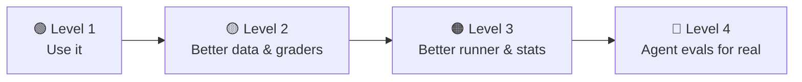

# Exercises & Next Steps

[← Chapter 13](../part-3-build/13-build-your-own.md) · [Contents](../README.md)

Each exercise extends [`mini_eval.py`](../part-3-build/code/mini_eval.py) and maps to a chapter. **For every change, add a test to `test_mini_eval.py`**, because an eval harness you can't trust is worse than none.

---

## 🟢 Level 1: Use it

**1.1 Sanity first.** Run oracle and null on all three datasets. Then break a reference answer on purpose and watch the oracle run catch it. *(Ch. 11)*

**1.2 Your first real eval.** Run `basics.jsonl` with `--reps 3`. Read `report.md`. How big is the error bar? Open two transcripts in `traces/`. *(Ch. 8)*

**1.3 Compare effort levels.** Run the same dataset with `--effort low` and `--effort high`, then `compare` them. Is the difference bigger than the noise? What about the cost difference? *(Ch. 8.5, 8.6)*

**1.4 Add 10 cases.** Write 10 new cases for `basics.jsonl` in a topic you know well, each with a `reference`. Run oracle to prove they're solvable. *(Ch. 5)*

## 🟡 Level 2: Better data & graders

**2.1 Dataset linter.** Write `lint_dataset.py` that reports duplicate inputs, missing references, tag balance, and very long prompts. *(Ch. 5, 11)*

**2.2 Multiple-choice grader.** Add a `choice` grader that extracts a single letter (A–D) robustly: "The answer is (B).", "B", "**B**". Write tests for tricky formats. *(Ch. 7.2)*

**2.3 JSON schema grader.** Add a `json_schema` grader: the output must parse and match a schema in the sample. *(Ch. 7.2)*

**2.4 Pairwise judge.** Add a `compare --judge` mode that shows a judge the outputs of two runs for each sample, **randomising the order**, allowing "tie", and reporting a win rate. *(Ch. 7.4)*

**2.5 Judge calibration.** Hand-grade 20 outputs from `writing.jsonl`, then measure how often the judge agrees with you, per criterion. *(Ch. 7.4)*

**2.6 Precision & recall.** Build a small "does this text contain a leaked API key?" dataset with positives **and** negatives, and report precision, recall, and the "always say no" baseline. *(Ch. 2.9)*

## 🟠 Level 3: Better runner & stats

**3.1 A dev/test split.** Add `--split dev|test` using a `split` field, assigned randomly and stratified by tag. *(Ch. 5.6)*

**3.2 Bootstrap CIs.** Add a bootstrap confidence interval (resample samples with replacement 10,000 times) and compare it with the normal approximation. *(Ch. 2, 8)*

**3.3 Retry accounting.** Record how many attempts each trial needed and show total retries in the report. *(Ch. 9.3)*

**3.4 Async runner.** Rewrite the runner with `asyncio` and `anthropic.AsyncAnthropic`, with a semaphore for concurrency. *(Ch. 3.5, 9.2)*

**3.5 HTML report.** Generate a `report.html` with a sortable table where each row links to its transcript. *(Ch. 8.2)*

**3.6 Batch mode.** Use the provider's batch API for chat evals (~50% cheaper, results within hours). *(Ch. 9.7)*

## 🔴 Level 4: Agent evals for real

**4.1 Docker sandbox.** Replace `new_workspace()` with a Docker container (`--network none`, memory and CPU limits), run the agent's commands inside it, and copy the hidden tests in only after the agent finishes. *(Ch. 10)*

**4.2 Protect the tests.** Add a check that fails the trial if the agent modified any pre-existing test file. Write a fake agent that tries it, and make sure you catch it. *(Ch. 11.3)*

**4.3 A mock service.** Build a tiny fake "calendar API" with FastAPI that records every call, give the agent tools for it, and grade on the final calendar state. *(Ch. 10.4)*

**4.4 Drift.** Change the calendar's data between two turns of a multi-turn task, and check whether the agent notices. *(Ch. 10.4)*

**4.5 Evaluate your agent harness.** Point the agent solver at the `mini_agent.py` from the [agent harness guide](https://github.com/Dakuaisu/harness-learning), change its system prompt, and use `compare` to find out whether the change *really* helped. **You're now doing harness engineering with evidence.** *(Ch. 1.7)*

**4.6 Run a real benchmark.** Install Inspect or lm-evaluation-harness and run a standard benchmark on a small model. Map each part of its output back to Chapter 4's five parts. *(Ch. 12)*

---

## 📖 Where to go next

- **Read real eval code**: Inspect's examples, the SWE-bench harness, WildClawBench. Find the dataset, solver, grader and metrics in each.
- **Read benchmark papers**: HumanEval (pass@k), SWE-bench and SWE-bench Verified (validating tasks), tau-bench (pass^k), WildClawBench (harness effects).
- **Build an eval for something you actually use.** The best way to learn is an eval whose results you care about.
- **Keep your provider's docs handy**: models, prices and API features change often.

## 🏁 Final self-check

You understand eval harnesses if you can explain:

- [ ] What are the five parts of an eval harness, and what does the runner do?
- [ ] Why can't you trust a score without an error bar, and how do reps change the calculation?
- [ ] What's the difference between pass@k and pass^k, and when does each matter?
- [ ] Why must timeouts and API errors be kept out of the scores?
- [ ] Why grade an agent's end state instead of its transcript?
- [ ] Name four biases of LLM judges and a fix for each.
- [ ] What are oracle and null runs, and what does each catch?
- [ ] What is contamination, and what is reward hacking?
- [ ] How would you decide whether prompt B is really better than prompt A?

If you can tick every box, you know how to build an eval harness. 🎉

[← Chapter 13](../part-3-build/13-build-your-own.md) · [Contents](../README.md)
