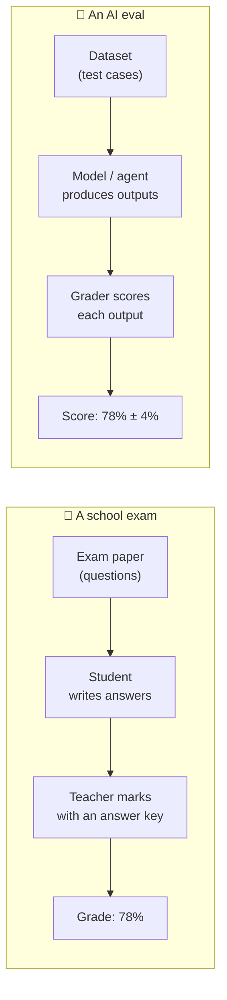
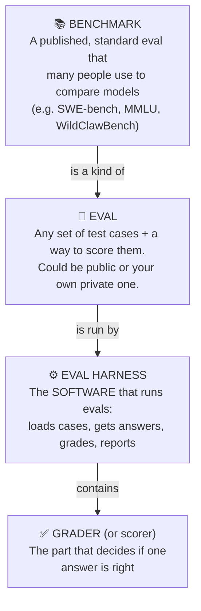
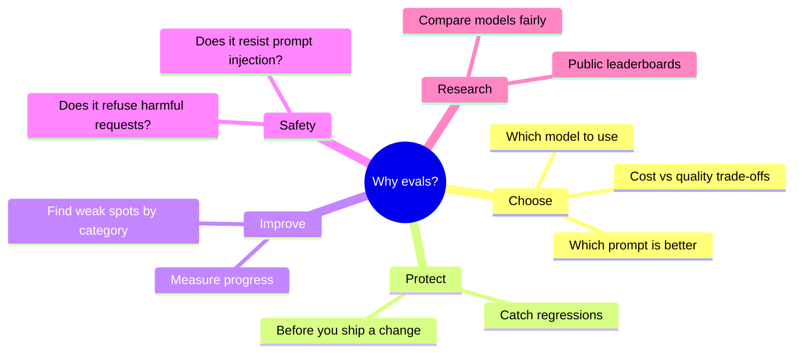
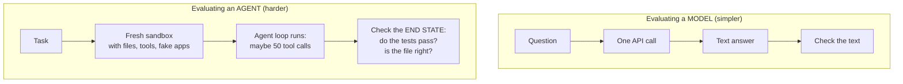
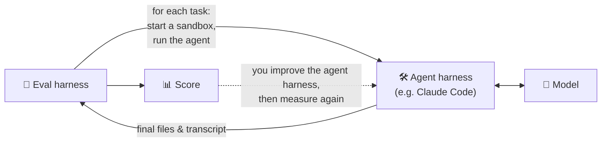

# Chapter 1: What Is an Eval?

[← Back to contents](../README.md) · Next: [Chapter 2: The statistics you need →](02-statistics-you-need.md)

---

## 1.1 The problem: "it looks good to me" doesn't scale

Imagine you've built an AI assistant. You try it on five questions and the answers look great. Then:
- You change the system prompt. Is it better now? Worse? You try five questions again... different ones... it *seems* fine?
- A new model comes out. Should you switch? It's cheaper. Is it as good?
- A customer complains it got something wrong. Did your last change cause that?

Trying a few examples by hand (people call this a **vibe check**) can't answer these questions. It's too small, too random, and too easy to fool yourself with.

> 🔑 **Key idea:** An **eval** (short for *evaluation*) replaces "it looks good to me" with **a repeatable measurement**: the same test, run the same way, scored the same way, every time.

---

## 1.2 The exam analogy

An eval is an **exam** for an AI.

Everything that makes a school exam fair applies to AI evals too:

| A fair exam... | A good eval... |
|---------------|----------------|
| has questions with clear right answers | has **unambiguous** test cases |
| uses an answer key that is actually correct | has **correct ground truth** |
| doesn't leak the answers beforehand | keeps answers **hidden** from the AI (no **contamination**) |
| is marked the same way for everyone | uses a **consistent grader** |
| has enough questions that luck doesn't decide your grade | has **enough samples** (and reports error bars) |
| tests what the course actually taught | measures **what you actually care about** |

---

## 1.3 The vocabulary

These words get mixed up a lot. Here's how they fit together:

| Term | Plain meaning | Example |
|------|--------------|---------|
| **Sample / case / task** | One test question | "What is 15% of 2,480?" |
| **Target / ground truth / gold** | The correct answer | 372 |
| **Dataset** | A collection of samples | 500 maths questions |
| **Solver** | Whatever produces the AI's answer | one API call, or a whole agent |
| **Grader / scorer** | Turns an answer into a score | "is the number 372?" |
| **Metric** | A summary number over many scores | accuracy = 78% |
| **Trial / rep / epoch** | One attempt at one sample. Many evals run each sample several times | 3 reps per sample |
| **Transcript / trajectory** | The full record of what the AI did during a trial | every message and tool call |

---

## 1.4 Why evals matter so much

A common saying among AI engineers: **"You can't improve what you can't measure."** Teams that build great AI products usually have great evals first. Every prompt change, model switch or harness tweak gets run through the evals before it ships.

---

## 1.5 Kinds of evals

| Kind | Question it answers | Example |
|------|---------------------|---------|
| **Capability eval** | "How good is it at X?" | Can it fix real bugs? (SWE-bench) |
| **Regression eval** | "Did my change break anything?" | Run 200 known cases after every prompt edit |
| **Safety eval** | "Does it avoid harmful behaviour?" | Does it leak secrets when a document tells it to? |
| **Product eval** | "Does *my app* work for *my users*?" | Does our support bot answer refund questions correctly? |
| **Model comparison** | "Is A better than B?" | Should we switch models? |

And two ways of running them:

| | **Offline eval** | **Online eval** |
|-|-----------------|----------------|
| When | Before shipping, on a fixed dataset | After shipping, on real traffic |
| How | Your eval harness | A/B tests, user feedback, monitoring |
| Good for | Fast, repeatable, safe comparisons | Seeing real-world impact |

This guide is about **offline** evals and the harness that runs them.

---

## 1.6 Evaluating a model vs. evaluating an agent

In the [agent harness guide](https://github.com/Dakuaisu/harness-learning) you learned that **Agent = Model + Harness**. That gives you two very different kinds of eval:

| | Model eval | Agent eval |
|-|-----------|------------|
| One trial takes | seconds | minutes |
| One trial costs | fractions of a cent | cents to dollars |
| Needs a sandbox | no | **yes** |
| What you grade | the text | mostly **what it did** (the end state) |
| Randomness | some | a lot (long chains of decisions) |

This guide covers both. Model evals teach the basics; agent evals add sandboxes (Chapter 10).

---

## 1.7 An eval harness is also an agent harness's best friend

Remember [Chapter 11 of the agent harness guide](https://github.com/Dakuaisu/harness-learning/blob/main/part-2-harness/11-real-harnesses.md): **an eval harness runs the agent harness** on many tasks and scores the results.

This loop, **change → measure → change → measure**, is how every serious AI product and research lab improves its systems.

## 🧪 Try it

Think of an AI tool you use. Write down three test questions you'd put in an eval for it, and for each one, *how you would decide automatically* whether the answer is right. (You'll find some are easy to check and some are very hard. That difficulty is Chapter 7.)

## ✅ Chapter summary

- An **eval** is a repeatable exam for an AI: dataset → answers → grades → metrics.
- An **eval harness** is the software that runs evals. A **benchmark** is a widely shared eval.
- Evals let you **choose**, **protect**, **improve**, and **check safety** with evidence instead of vibes.
- Evaluating **agents** is harder than evaluating models: slower, costlier, needs sandboxes, and grades the end state.

[← Back to contents](../README.md) · Next: [Chapter 2: The statistics you need →](02-statistics-you-need.md)
