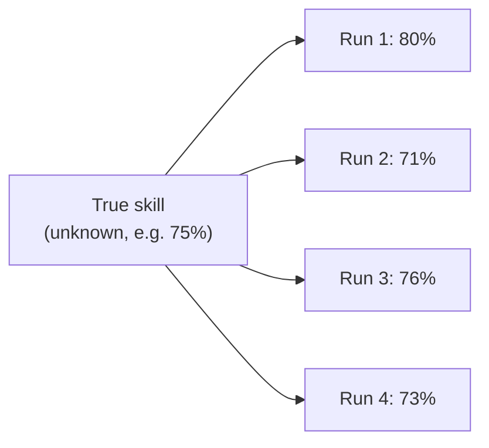
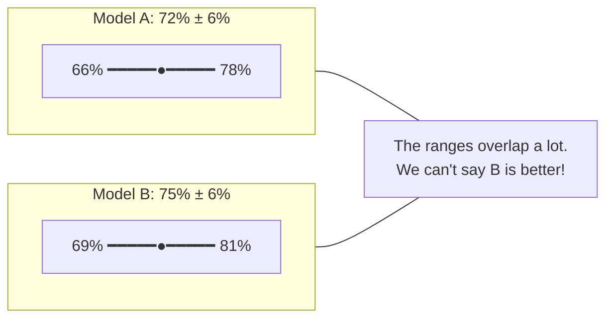
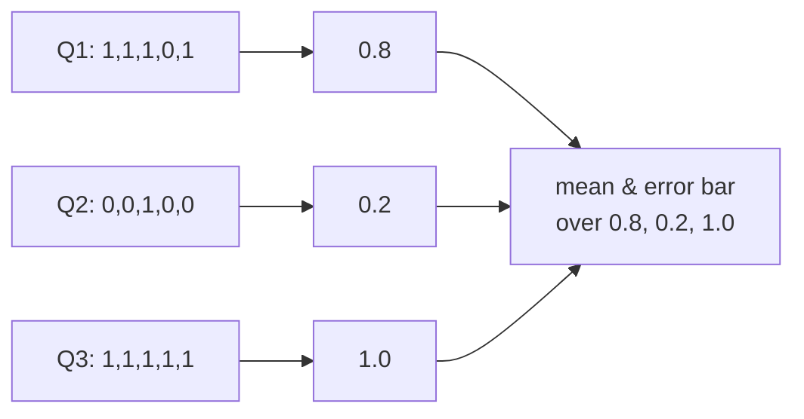
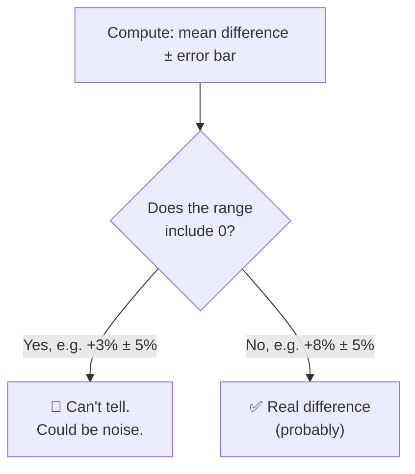
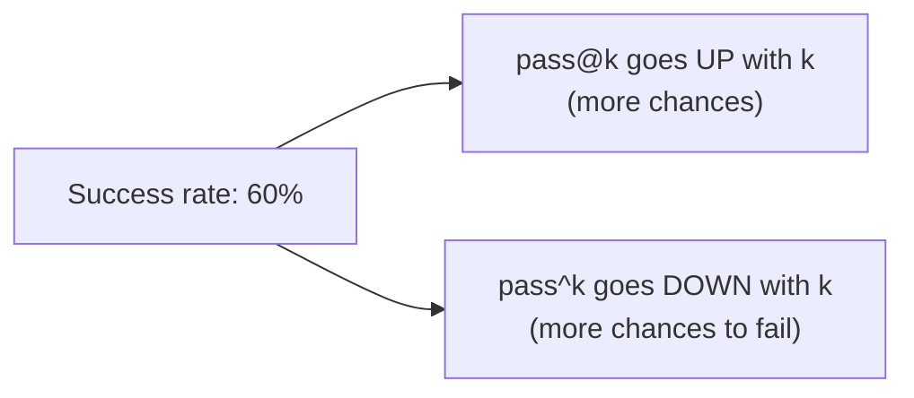

# Chapter 2: The Statistics You Need (Without the Scary Maths)

[← Chapter 1](01-what-is-an-eval.md) · [Contents](../README.md) · Next: [Chapter 3: Tools & skills →](03-tools-and-skills.md)

An eval produces numbers. This chapter teaches you just enough statistics to know **when to believe them**. Every idea comes with an everyday analogy. There are a few formulas, but you can use each one without understanding the maths behind it.

---

## 2.1 Why one run proves nothing: coin flips

Flip a fair coin 10 times. You might get 7 heads. Does that mean the coin lands heads 70% of the time? No, you just got a bit lucky.

AI models are similar. They have **randomness** built in, and your test set is only a **sample** of all the questions that exist. So every score has some **luck** in it.



> 🔑 **Key idea:** A score is an **estimate** of the true skill, not the true skill itself. A good eval tells you both the estimate **and how uncertain it is**.

Two sources of luck:
1. **Which questions you picked** (sampling noise). With a different 100 questions, you'd get a different score.
2. **The model's own randomness** (run-to-run noise). The same question can get a different answer each time.

---

## 2.2 The average (mean)

Add up the scores and divide by how many there are.

```
Scores: 1, 0, 1, 1, 0, 1, 1, 1, 0, 1      (1 = right, 0 = wrong)
Mean   = 7 / 10 = 0.7 = 70%
```

When every score is 0 or 1, the mean is just **accuracy** (the percentage right). Scores can also be in between, such as 0.5 for "half the rubric met".

## 2.3 Spread: standard deviation

Two classes both average 70% on a test:
- Class A: everyone got between 65% and 75%.
- Class B: half got 40%, half got 100%.

Same average, very different stories. **Standard deviation** (SD) measures how spread out the scores are. Small SD means consistent; large SD means all over the place.

You don't need to compute it by hand; Python does it: `statistics.stdev(scores)`.

---

## 2.4 Standard error: how wobbly is the average?

This is the important one. The **standard error** (SE) tells you how much your *average* would wobble if you re-ran the eval with a different set of questions.

```
SE = SD / √n          (n = number of samples)
```

The key insight is the **√n**: to halve the wobble, you need **four times** as many samples.

| Samples (n) | 95% error bar on a pass rate near 50% |
|-------------|------------------------------------------|
| 25 | ± 20 percentage points |
| 100 | ± 10 points |
| 400 | ± 5 points |
| 1,600 | ± 2.5 points |

> 😮 With 25 test cases, a model scoring 60% and one scoring 75% might be **equally good**. The difference could be pure luck. Small evals can only detect **big** differences.

---

## 2.5 Error bars: the 95% confidence interval

A **95% confidence interval** (CI) is a range that probably contains the true skill:

```
95% CI = mean ± 1.96 × SE
```

You report it like this: **"72% ± 6%"**, meaning the true score is probably between 66% and 78%.



> 🔑 **Key idea:** Never report an eval score without an error bar. "75%" alone invites people to over-trust it. "75% ± 6%" tells them how much to trust it.

---

## 2.6 Repeats (reps) and why they need care

Because models are random, good evals run each sample several times ("reps", "epochs" or "trials"). But careful: 100 questions × 5 reps is **not** the same as 500 independent questions. The 5 answers to one question are related: an easy question tends to be right all 5 times.

The correct approach (used in Part 3's code):
1. Average the reps **within** each question first → one score per question.
2. Compute the mean and error bar **across questions**.



Reps shrink the model's run-to-run noise, but they can't fix having too few questions.

---

## 2.7 Comparing two systems: the paired difference

The best way to compare Model A and Model B is to run **both on the same questions** and look at the difference **question by question**.

```
Question:   Q1   Q2   Q3   Q4   Q5
A's score:  1    0    1    1    0
B's score:  1    1    1    1    0
B − A:      0   +1    0    0    0     → mean difference = +0.2
```

Why is this better than comparing two separate averages? Because hard questions are hard for **both** models. Pairing cancels out that shared difficulty, so the error bar on the **difference** is much smaller. A **paired** comparison can detect smaller improvements with the same number of questions.

Rule for deciding:



---

## 2.8 pass@k and pass^k: "any" vs. "every"

If you give an AI **k tries** at a problem:

| Metric | Question | Real-world meaning |
|--------|----------|--------------------|
| **pass@k** ("pass at k") | Does **at least one** of k tries succeed? | "If it can retry and we can check the answer, will it get there?" (e.g. code with tests) |
| **pass^k** ("pass hat k") | Do **all** k tries succeed? | "Can I trust it **every time**?" (e.g. a customer-service agent handling thousands of users) |

Example: an agent solves a task 60% of the time.
- pass@1 = 60%
- pass@3 ≈ 94% (it'll probably get one out of three)
- pass^3 ≈ 22% (it'll rarely get all three right)



> 🔑 **Key idea:** pass@k measures **capability** ("can it ever?"). pass^k measures **reliability** ("does it always?"). For products, reliability usually matters more.

The exact formulas (estimated from n tries with c successes):

```
pass@k = 1 − C(n−c, k) / C(n, k)
pass^k =     C(c, k)   / C(n, k)
```

`C(a, b)` means "a choose b", the number of ways to pick b items from a (`math.comb(a, b)` in Python). You don't need to understand why these work to use them; Chapter 8 explains the idea, and Part 3 has them in code with tests.

---

## 2.9 Precision and recall: when "accuracy" misleads

Imagine an eval for "does the AI spot a leaked password in a file?" 95 files are clean and 5 contain a leak. An AI that **always says "clean"** gets 95% accuracy, while catching zero leaks!

For yes/no detection tasks, use a **confusion matrix**:

|  | AI says "leak" | AI says "clean" |
|--|---------------|----------------|
| **Really a leak** | ✅ True positive (TP) | ❌ False negative (FN): missed it |
| **Really clean** | ❌ False positive (FP): false alarm | ✅ True negative (TN) |

| Metric | Formula | Plain meaning |
|--------|---------|---------------|
| **Precision** | TP / (TP + FP) | When it raises an alarm, how often is it right? |
| **Recall** | TP / (TP + FN) | Of the real leaks, how many did it catch? |
| **Specificity** | TN / (TN + FP) | Of the clean files, how many did it correctly leave alone? |

> 🔑 **Key idea:** Always compare against a **dumb baseline** (always say "clean", always pick the most common answer). If your AI barely beats it, your eval or your AI has a problem.

---

## 2.10 Two traps to avoid

**Trap 1: Trying many things and reporting the best.** If you try 20 prompt variants, one of them will look better *by luck alone*. Fix: keep a separate **held-out test set** that you only check at the end (Chapter 5).

**Trap 2: Chasing tiny differences.** A "+1%" improvement on a 100-question eval is noise. Decide the **smallest improvement you'd actually care about** *before* running, and make sure your eval is big enough to see it.

To size the eval, remember 2.6: **the question is the unit of evidence, not the trial.** Repeated runs of the same question aren't independent. A question that's hard for a model tends to be hard on every rep. So you can't multiply questions by reps as if every trial were a new question. Work out a paired difference the way Part 3's `compare` command does:

1. For A and for B, average the reps **within** each question.
2. Take the difference B − A for each question.
3. Error bar ≈ 1.96 × SD(those differences) / √(number of questions).

Reps make each question's difference less noisy, which can shrink the SD a little. But they can't remove real differences between questions, and they don't touch the √(number of questions) underneath. **The number of questions sets the error bar.**

Worked example: 100 questions, one rep each. B beats A on 12 questions, loses on 6, and ties on the other 82. The differences are twelve +1s, six −1s and 82 zeros: mean +6%, SD ≈ 0.42, error bar ≈ 1.96 × 0.42 / √100 ≈ ±8 points. **+6% ± 8%: you can't tell.**
- **Run 3 reps instead of 1:** if those questions keep going the same way, the per-question differences barely change, and it's still about ±8 points.
- **Use 400 similar questions instead** (B wins 48, loses 24): ±4 points. **+6% ± 4%** is now a real difference.

## 🧪 Try it

1. An eval has 50 questions and model A scores 80%. Roughly how big is the error bar? (Hint: use the table in 2.4. Around ±11 points.)
2. An agent succeeds 90% of the time. Estimate pass^5. (Hint: 0.9⁵. About 59%. Surprisingly low!)

## ✅ Chapter summary

- Every score contains **luck**: from which questions you picked, and from model randomness.
- **Standard error** shrinks with √n: 4× the samples for ½ the wobble.
- Report scores **with 95% confidence intervals**: "72% ± 6%".
- With **reps**, average within each question first, then across questions.
- Compare systems with **paired differences** on the same questions. If the interval includes 0, you can't tell.
- **pass@k** = any of k succeed (capability); **pass^k** = all k succeed (reliability).
- For detection tasks, use **precision/recall**, and always compare against a **dumb baseline**.

[← Chapter 1](01-what-is-an-eval.md) · [Contents](../README.md) · Next: [Chapter 3: Tools & skills →](03-tools-and-skills.md)
