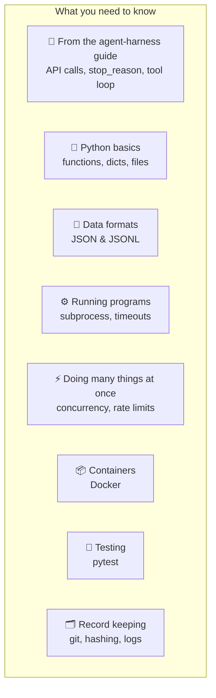
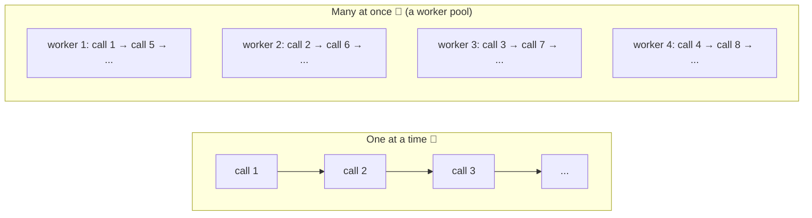
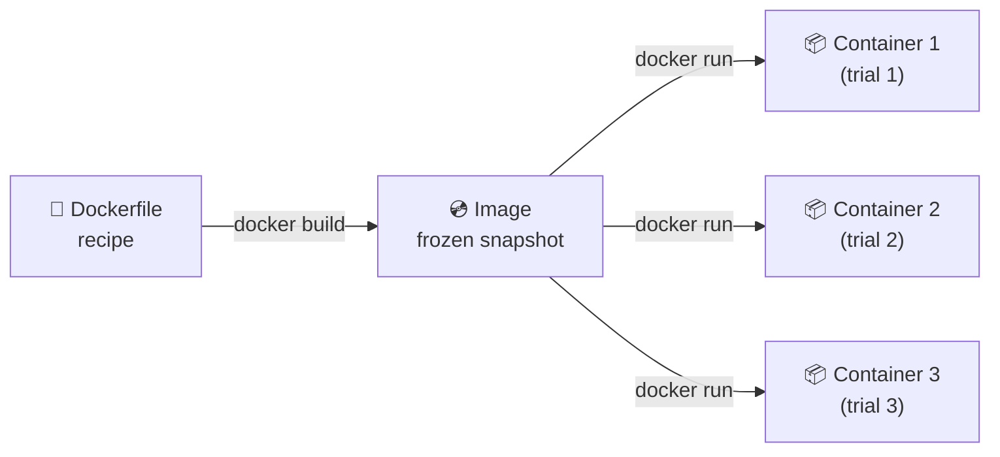

# Chapter 3: Tools & Skills You Need

[← Chapter 2](02-statistics-you-need.md) · [Contents](../README.md) · Next: [Chapter 4: Anatomy of an eval harness →](../part-2-eval-harness/04-anatomy.md)

An eval harness is ordinary software that runs a lot of things, safely and quickly, and keeps careful records. This chapter lists the building blocks, explains each in plain English, and says **why an eval harness needs it**.



---

## 3.1 What you need from the agent-harness guide

If you haven't read the [agent harness guide](https://github.com/Dakuaisu/harness-learning), these are the parts you need. Each is one chapter there:

| Concept | Why an eval harness needs it | Chapter there |
|---------|------------------------------|---------------|
| An LLM predicts text, is **random**, and is **stateless** | Randomness is why we need reps and error bars | 2 |
| **Messages, roles, system prompt**, and the response's `stop_reason` and `usage` | The solver makes these calls; the runner records tokens and cost | 3 |
| `stop_reason`: `end_turn`, `tool_use`, `max_tokens`, `refusal` | A cut-off answer (`max_tokens`) must not be scored as a wrong answer | 3 |
| **Tool use** and the **agent loop** | To evaluate agents, your harness runs one | 6, 7 |
| **Sandboxes** | Agents under test run code; that must be contained | 9 |

---

## 3.2 Python basics you'll use constantly

```python
# Dictionaries: one test sample is a dict
sample = {"id": "math-01", "input": "What is 2+2?", "target": 4, "tags": ["math"]}
print(sample["target"])              # 4
print(sample.get("tolerance", 0))    # 0  (default if the key is missing)

# Lists and comprehensions: turning many results into numbers
scores = [1, 0, 1, 1]
accuracy = sum(scores) / len(scores)                         # 0.75
failed = [s for s in samples if s["score"] == 0]             # filter

# Grouping: scores per category
from collections import defaultdict
by_tag = defaultdict(list)
for r in results:
    by_tag[r["tags"][0]].append(r["score"])

# Files and paths
from pathlib import Path
Path("runs/today").mkdir(parents=True, exist_ok=True)
Path("runs/today/notes.txt").write_text("hello")
```

---

## 3.3 JSON Lines (JSONL): the eval world's favourite format

**JSON** you know from the agent guide. **JSONL** is simply **one JSON object per line**:

```jsonl
{"id": "q1", "input": "What is 2+2?", "target": 4}
{"id": "q2", "input": "Capital of France?", "target": "Paris"}
```

Why evals love it:

| Reason | Explanation |
|--------|-------------|
| **Append as you go** | Write one line the moment a trial finishes. A crash never loses finished work. |
| **Stream big files** | Read one line at a time. No need to load a 2 GB file into memory. |
| **Easy to combine** | `cat a.jsonl b.jsonl > all.jsonl` just works. |
| **Diff-friendly** | Git shows exactly which cases changed. |

```python
import json
# Read
samples = [json.loads(line) for line in open("data.jsonl") if line.strip()]
# Append one result
with open("results.jsonl", "a") as f:
    f.write(json.dumps(row) + "\n")
    f.flush()      # push it to disk now, not later
```

---

## 3.4 Running other programs: `subprocess`

Graders often need to **run code**: the model's code, or hidden tests against it. Python's `subprocess` does this:

```python
import subprocess, sys
result = subprocess.run(
    [sys.executable, "hidden_test.py"],   # run a Python file
    cwd="workspace/",                     # in this folder
    capture_output=True, text=True,       # collect what it prints
    timeout=60,                           # kill it if it takes too long!
)
passed = result.returncode == 0           # 0 means success, by convention
```

> ⚠️ **Always set a timeout.** Model-written code can contain infinite loops. Without a timeout, one bad answer freezes your whole eval.

> ⚠️ **Model-written code is untrusted.** It might delete files or worse, by accident. Run it in a throwaway folder at minimum, and in a container for anything serious (Chapter 10).

---

## 3.5 Doing many things at once: concurrency

An eval with 500 cases × 3 reps = 1,500 API calls. At 10 seconds each, one at a time, that's **4 hours**. With 20 running at once, it's about **12 minutes**.



In Python the simplest tool is a **thread pool**:

```python
from concurrent.futures import ThreadPoolExecutor, as_completed

with ThreadPoolExecutor(max_workers=8) as pool:
    futures = [pool.submit(run_one_trial, s) for s in samples]
    for future in as_completed(futures):        # results arrive as each finishes
        save(future.result())
```

(`asyncio` is the other common option. It's more efficient for thousands of concurrent calls, but trickier to learn. Threads are fine to start with.)

### Rate limits

APIs limit how many requests or tokens you can send per minute. Go over, and you get **HTTP 429 "Too Many Requests"**. The fix:
- **Cap concurrency** (`max_workers`) to stay under your limit.
- **Retry with backoff and jitter**: wait a bit, then retry, waiting longer each time, with a random wiggle ("jitter") so all workers don't retry at the same instant. Official SDKs, like Anthropic's, do this for you (`max_retries=5`).

---

## 3.6 Containers: Docker in five minutes

A **container** is a lightweight, isolated mini-computer. You describe it once in a **Dockerfile**, build an **image** (a frozen snapshot), then start as many **containers** (running copies) as you like. Each one starts identical and fresh.



```dockerfile
# Dockerfile: an environment for an agent task
FROM python:3.12-slim
RUN pip install pandas pytest
WORKDIR /workspace
COPY task_files/ /workspace/
```

```bash
docker build -t my-task:v1 .
docker run --rm --network none my-task:v1 python -c "print('isolated!')"
#            │       └── no internet access
#            └── delete the container when it exits
```

Why evals need it: **every trial gets an identical, fresh, isolated world**, and whatever the agent breaks gets thrown away. Chapter 10 goes deeper.

---

## 3.7 Testing your harness: pytest

Your eval harness is software, and **buggy eval code produces confident, wrong numbers**. Test it like any other code. `pytest` finds functions named `test_*` and runs them:

```python
# test_graders.py
from graders import grade_numeric

def test_accepts_equivalent_number_formats():
    assert grade_numeric({"target": 1234}, {"output": "ANSWER: 1,234"})["score"] == 1.0

def test_rejects_wrong_number():
    assert grade_numeric({"target": 1234}, {"output": "ANSWER: 1235"})["score"] == 0.0
```

```bash
pytest -q          # → 2 passed
```

pytest also shows up **inside** evals: hidden unit tests are the most common way to grade coding tasks.

---

## 3.8 Record keeping: git, hashing, logs

To trust (and reproduce) a result months later, you must know **exactly** what produced it.

| Tool | What it records | Example |
|------|-----------------|---------|
| **git** | Which version of the harness code and dataset | commit `a1b2c3d` |
| **Hash** (SHA-256) | A fingerprint of a file. If one byte changes, the hash changes | `dataset_sha: b681e4aae8c1` |
| **Config file** | Every setting of the run | model, effort, reps, judge model |
| **Transcripts / logs** | Everything the AI did in each trial | messages, tool calls, outputs |

```python
import hashlib
fingerprint = hashlib.sha256(open("data.jsonl", "rb").read()).hexdigest()[:12]
```

> 🔑 **Key idea:** Scores from different dataset versions, grader versions, or settings **cannot be compared**. Record everything, so you know when two numbers are comparable.

---

## 3.9 Environment variables and secrets

API keys go in **environment variables**, never in code or datasets:

```bash
export ANTHROPIC_API_KEY="sk-ant-..."
```

And never let a secret end up somewhere the model **under test** can read it. For example, don't put a key in a file inside an agent's sandbox. The model might print it, and your transcript logs would then contain it.

## 🧪 Try it

1. Write a 3-line JSONL file of quiz questions and load it with the snippet in 3.3.
2. Use `subprocess.run` with `timeout=2` to run `python -c "while True: pass"`. Watch the timeout save you (it raises `subprocess.TimeoutExpired`).

## ✅ Chapter summary

- From the agent guide: **API calls, `stop_reason`, `usage`, the tool loop, sandboxes**.
- **JSONL** (one JSON object per line) lets you save each result the moment it finishes.
- **subprocess** runs code for grading. Always use **timeouts** and treat model code as untrusted.
- **Concurrency** makes evals fast. **Rate limits** make you cap it and retry with backoff.
- **Docker** gives every trial an identical, fresh, isolated world.
- **pytest** tests your harness, and often grades the model too.
- **Record everything** (git commit, dataset hash, config, transcripts), or your numbers can't be trusted or compared.

## 🎓 You've finished the prerequisites!

[← Chapter 2](02-statistics-you-need.md) · [Contents](../README.md) · Next: [Chapter 4: Anatomy of an eval harness →](../part-2-eval-harness/04-anatomy.md)
