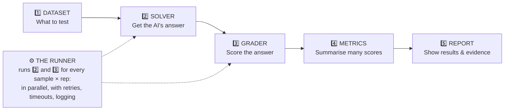
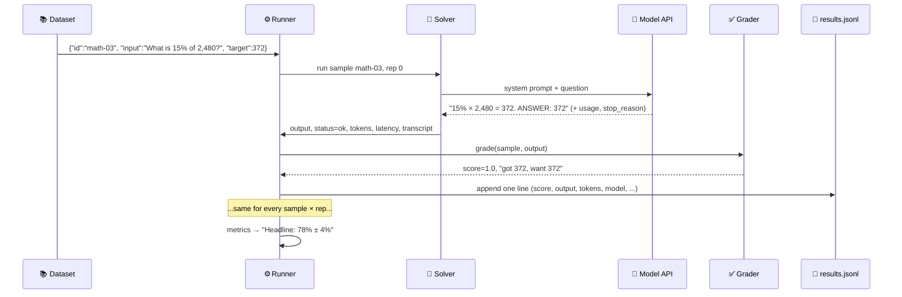
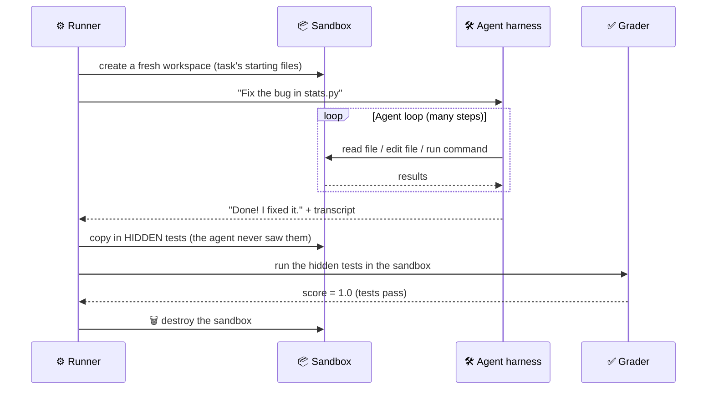

# Chapter 4: Anatomy of an Eval Harness

[← Chapter 3](../part-1-prerequisites/03-tools-and-skills.md) · [Contents](../README.md) · Next: [Chapter 5: Datasets & tasks →](05-datasets-and-tasks.md)

Every eval harness, from a 50-line script to a research lab's giant system, has the same five parts. Learn these five and you can read any eval framework's documentation.

---

## 4.1 The five parts



| Part | Job | Chapter |
|------|-----|---------|
| **Dataset** | A list of samples: input, correct answer or checks, tags | 5 |
| **Solver** | Turns one sample into one answer: a single API call, or a full agent run in a sandbox | 6, 10 |
| **Grader** (scorer) | Turns one answer into a score (0 to 1) plus an explanation | 7 |
| **Metrics** | Turns all the scores into headline numbers with error bars | 8 |
| **Report** | Shows the numbers, breakdowns, failures and transcripts | 8, 13 |
| **Runner** | The engine: loops over everything, fast and safely, and saves every record | 9 |

> 💡 Different frameworks use different names. The UK AI Security Institute's **Inspect** calls them *Dataset → Solver → Scorer*. Others say *task → agent → grader* or *benchmark → policy → verifier*. Same ideas.

---

## 4.2 Following one sample through the harness

Let's trace a single maths question from start to finish:



And for an **agent** task, only the solver and grader change:



> 🔑 **Key idea:** For agents, the grader ignores what the agent *says* ("Done!") and checks what it *did* (do the tests pass?). An agent that claims success but changed nothing scores 0.

---

## 4.3 What a sample looks like

```json
{
  "id": "code-02",
  "input": "Write a Python function flatten(items) that...",
  "grader": "python_tests",
  "tests": "from solution import flatten\nassert flatten([1, [2, [3]]]) == [1, 2, 3]\n",
  "tags": ["code", "medium"],
  "reference": "```python\ndef flatten(items): ...```"
}
```

| Field | Purpose |
|-------|---------|
| `id` | Unique name, so you can track this case across runs forever |
| `input` | What the AI sees |
| `target` / `tests` / `rubric` | What the **grader** uses. Never shown to the AI |
| `grader` | Which grading method to use |
| `tags` | Categories for breakdowns ("how good at code vs. maths?") |
| `reference` | A known-good answer, used to **test the eval itself** (Chapter 11) |

## 4.4 What one result row looks like

Every trial produces one record. Save **everything** you might need later:

```json
{
  "id": "code-02", "rep": 1, "tags": ["code", "medium"],
  "status": "ok", "score": 1.0, "explanation": "all tests passed",
  "output": "```python\ndef flatten(items): ...```",
  "model": "claude-opus-5-5",
  "usage": {"input_tokens": 212, "output_tokens": 164},
  "latency_s": 3.4
}
```

Plus a separate **transcript** file with every message and tool call, which is how you debug surprising scores.

---

## 4.5 The folder layout of a run

```
runs/basics_chat_claude-opus-5-5_20260929-1015/
├── config.json      ← exactly what was run (model, settings, dataset hash)
├── results.jsonl    ← one line per scored trial
├── errors.jsonl     ← trials that broke for non-AI reasons (timeouts, API errors)
├── traces/          ← full transcript per trial: code-02_rep1.json, ...
└── report.md        ← the human-readable summary
```

Keeping **errors separate from results** is one of the most important design choices in an eval harness. A network timeout is not the AI getting the answer wrong! Chapter 9 explains this in detail.

---

## 4.6 The design principles

These principles run through the whole of Part 2:

```mermaid
flowchart TB
    P1["🎯 Measure what you care about<br/>(realistic tasks, right grader)"]
    P2["🔁 Be reproducible<br/>(record config, fix versions)"]
    P3["🧱 Isolate trials<br/>(fresh state every time)"]
    P4["🙈 Hide the answers<br/>(ground truth unreachable)"]
    P5["🧾 Keep all evidence<br/>(transcripts, not just scores)"]
    P6["📏 Report uncertainty<br/>(error bars, reps)"]
    P7["🔌 Separate plumbing from performance<br/>(errors ≠ wrong answers)"]
    P8["🧪 Test the eval itself<br/>(oracle & null runs)"]
```



## ✅ Chapter summary

- Five parts: **Dataset → Solver → Grader → Metrics → Report**, driven by a **Runner**.
- A **sample** has an id, an input, grading info (hidden from the AI), tags, and ideally a reference answer.
- A **result row** records the score *and* everything needed to understand it: output, model, tokens, time, status.
- For **agents**, the solver runs a whole agent in a sandbox, and the grader checks the **end state**.
- Keep **errors apart from scores**, keep **transcripts**, and record the **config**.

[← Chapter 3](../part-1-prerequisites/03-tools-and-skills.md) · [Contents](../README.md) · Next: [Chapter 5: Datasets & tasks →](05-datasets-and-tasks.md)
