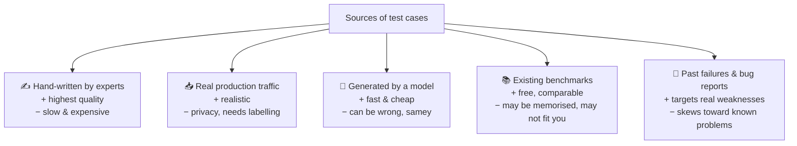
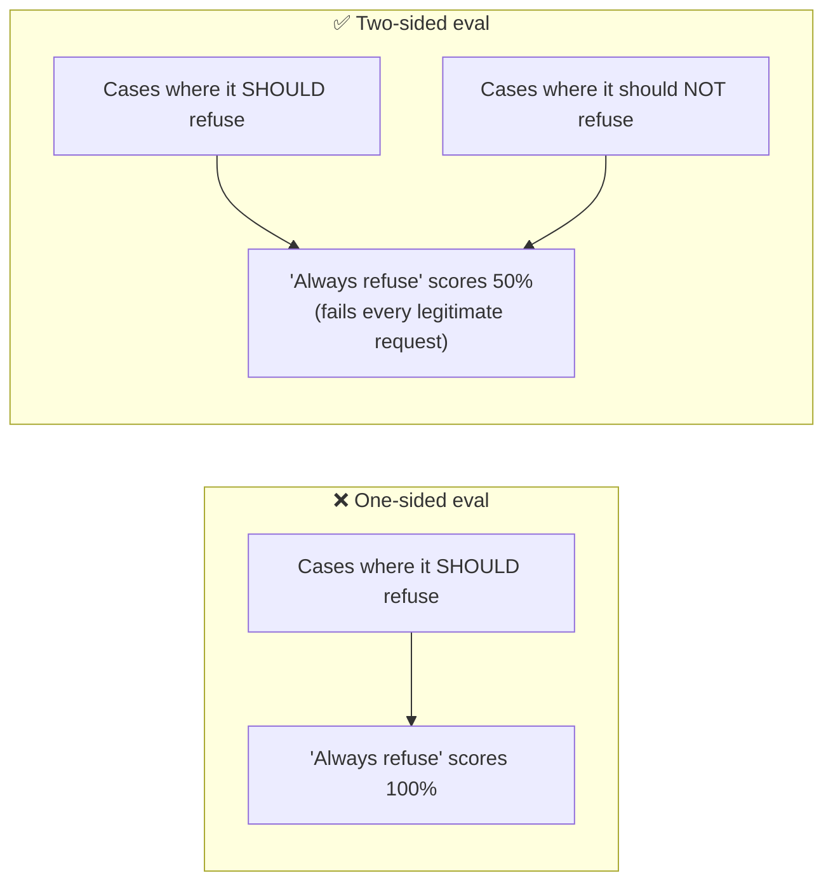
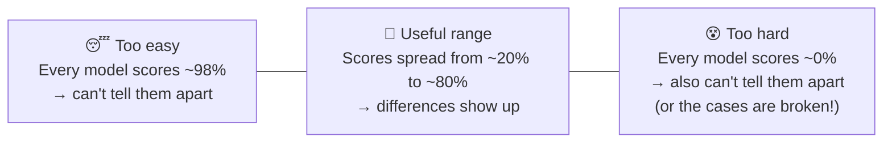
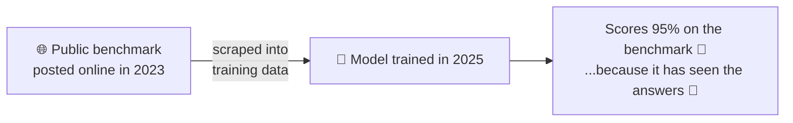
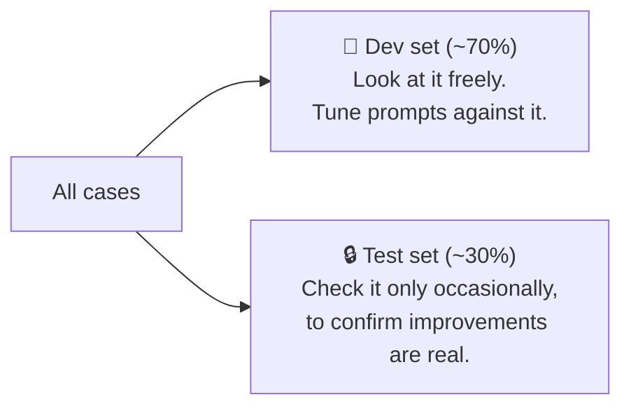
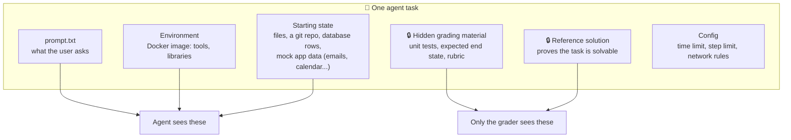

# Chapter 5: Datasets & Tasks

[← Chapter 4](04-anatomy.md) · [Contents](../README.md) · Next: [Chapter 6: Solvers →](06-solvers.md)

The dataset is the **most important part** of an eval. A perfect harness running bad test cases produces precise, confident, **wrong** numbers. This chapter covers where cases come from, what makes a case good, and the many subtle ways cases go wrong.

---

## 5.1 Where test cases come from

A healthy eval usually mixes several sources. A great habit: **every time your AI fails in real life, turn that failure into a new test case.** Your eval becomes a living record of everything that has ever gone wrong.

> ⚠️ If cases come from **real users**, handle privacy **before** copying data: remove personal information and check what you're allowed to keep.

---

## 5.2 What makes a good test case

Use this checklist for every case:

| ✅ Quality | Question to ask | Bad example → Better |
|-----------|-----------------|---------------------|
| **Unambiguous** | Would two experts agree on pass/fail? | "Write a good summary" → "Summarise in one sentence that mentions the price and the date" |
| **Correct ground truth** | Is the answer key actually right? (Re-derive it!) | Many famous benchmarks contain wrong labels |
| **Solvable** | Does a known-good reference answer pass the grader? | A case every model fails is often a *broken* case, not a hard one |
| **Tests the skill, not memory** | Could the model answer from memorised facts without doing the work? | "Who wrote Hamlet?" (a memory test) vs. a fictional company's records (a reasoning test) |
| **Hard for the right reason** | Is the *problem* hard, or just the *wording*? | Confusing wording measures prompt-deciphering |
| **No leaked answers** | Is the answer visible anywhere the AI can see? | Few-shot examples copied from the test set |
| **Realistic** | Does it look like real use? | Tidy textbook questions vs. messy real requests |

### Agent tasks: give the symptom, not the solution

For agent tasks, a common mistake is **over-helping** in the prompt:

| ❌ Over-specified | ✅ Realistic |
|------------------|-------------|
| "The bug is on line 12 of stats.py: the loop starts at index 1 instead of 0. Change `numbers[1:]` to `numbers`." | "average() in stats.py gives wrong answers. Fix it." |

The first version tests whether the agent can follow directions. The second tests whether it can **find and fix** a bug, which is the skill you care about.

---

## 5.3 Coverage: test both directions

If you only test "does the agent search the web when it should?", an agent that **always** searches gets a perfect score. You also need "does it **not** search when it shouldn't?"

The same goes for tool use, asking clarifying questions, escalating to a human, and safety refusals.

Also check **balance**: if 90% of cases have the answer "no", a model that always says "no" looks brilliant. Report the **dumb-baseline score** next to your model's score.

---

## 5.4 Difficulty: aim for the useful middle

- **Saturation**: when the best systems score near 100%, the eval stops being useful. The last few points mostly measure formatting quirks and grader edge cases. Retire or harden it.
- **Headroom**: the gap between today's score and 100%. You need headroom to see improvements.
- A mix of easy, medium and hard cases (tagged!) lets you see progress at every level.

---

## 5.5 Contamination: when the answers leaked

Models are trained on huge amounts of internet text. If your test cases (or their answers) were on the internet, the model may have **memorised** them. Then a high score means good memory, not good skill.

Defences:
- **Keep private test sets** that never go online.
- **Write new cases** after the model's training cutoff, or use **synthetic/fictional** data (made-up companies, invented files).
- **Rephrase** public questions and check whether the score drops a lot. A big drop suggests memorisation.
- Some public benchmarks include a **canary string**, a unique random ID that asks model builders to exclude the benchmark from training data.

---

## 5.6 Splits: don't grade your own homework

If you tweak your prompt again and again while watching the same eval score, you'll eventually **overfit**: your prompt becomes tuned to *those exact cases* and doesn't improve in general.

Rules:
- Split **randomly** (stratified by category), never by picking the cases the model currently fails.
- If dev improves a lot but test doesn't, you've overfitted.

---

## 5.7 How many cases do you need?

It depends on the **smallest improvement you care about** (Chapter 2):

| Cases × reps | Roughly detects differences bigger than |
|-------------|------------------------------------------|
| 25 × 2 | ~14 points |
| 100 × 2 | ~7 points |
| 400 × 2 | ~3.5 points |

Start small (20–50 good cases beats 1,000 sloppy ones), make sure the eval **works**, then grow it.

---

## 5.8 Anatomy of an agent task

Agent tasks are bigger than a question and an answer. They describe a whole **world**:

Real example: in **WildClawBench**, each task folder has persona files (who the agent is), data files, seed data for ~16 fake apps (Gmail, Calendar...), a script of timed user messages, "injections" that change the world between turns, and hidden tests and a rubric that are only added **after** the agent finishes.

---

## 5.9 Versioning the dataset

Datasets change: you fix a wrong label, add cases, retire saturated ones. **Scores from different versions can't be compared.**
- Give samples **permanent ids**; never reuse an id for a different question.
- Record a **hash** of the dataset file with every run (the Part 3 harness does this).
- Keep the dataset in **git** and note changes.

## 🧪 Try it

Take these three test cases and find what's wrong with each:
1. *"Is this code good?"* (graded pass/fail)
2. *"What year did the Berlin Wall fall?"* (in an eval meant to test web-search skill)
3. A refusal eval where all 50 cases are harmful requests.

Answers

1. Ambiguous: "good" isn't checkable. Define specific properties.
2. Answerable from memory: the model doesn't need to search. Use obscure or fictional facts.
3. One-sided: "always refuse" scores 100%. Add legitimate requests that should be answered.

## ✅ Chapter summary

- The dataset matters most. Mix sources, and **turn real failures into new cases**.
- Good cases are **unambiguous, correct, solvable, skill-testing, realistic, and leak-free**.
- Test **both directions**, check **balance**, and report the **dumb baseline**.
- Aim for **useful difficulty**; watch for **saturation** and **contamination**.
- Use **dev/test splits** to avoid overfitting. Size the set to the difference you care about.
- Agent tasks define a whole **world**: environment, starting state, and hidden grading material.
- **Version** everything; scores from different dataset versions don't compare.

[← Chapter 4](04-anatomy.md) · [Contents](../README.md) · Next: [Chapter 6: Solvers →](06-solvers.md)
