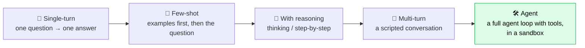
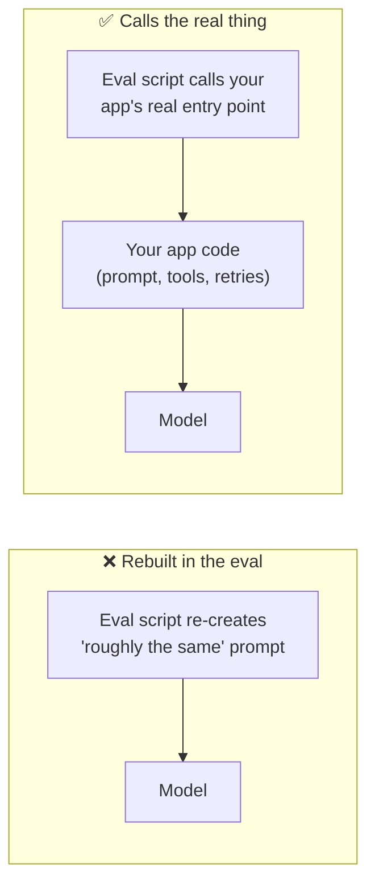
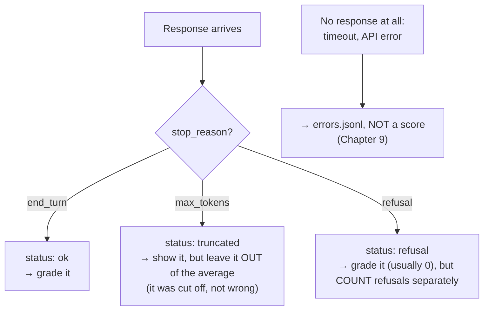
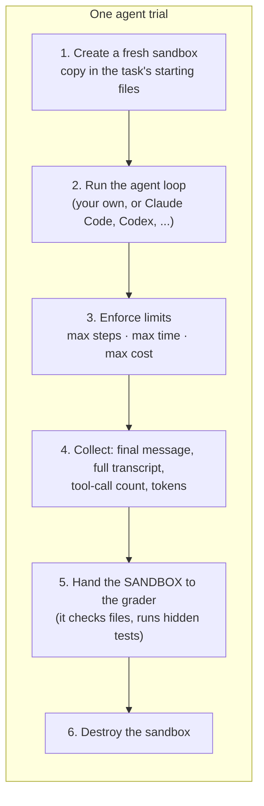

# Chapter 6: Solvers: Getting the AI's Answer

[← Chapter 5](05-datasets-and-tasks.md) · [Contents](../README.md) · Next: [Chapter 7: Graders →](07-graders.md)

The **solver** is the part of the harness that turns one sample into one answer. It sounds simple (call the API!), but small solver details can swing scores by 10 points or more. This chapter covers the kinds of solvers and the settings that matter.

---

## 6.1 Kinds of solvers



| Solver | Good for | Cost per trial |
|--------|----------|----------------|
| **Single-turn** | Knowledge, maths, classification, writing | cheap |
| **Few-shot** | Teaching the answer format with examples | cheap |
| **With reasoning** | Hard problems; modern models "think" before answering | medium |
| **Multi-turn** | Conversations: does it remember, stay consistent, handle changes? | medium |
| **Agent** | Real tasks: coding, research, using apps | expensive |

---

## 6.2 The golden rule: evaluate what you ship

> 🔑 **Key idea:** The solver must run the AI **exactly as it runs in production**: same system prompt, same tools, same model version, same settings. If your eval calls the model differently from your app, you're measuring a different system.



For your own product, the solver should call **your app's real code**, with only dangerous side effects (sending emails, charging cards) swapped for fakes.

---

## 6.3 Settings that change scores

Record every one of these in the run's config:

| Setting | What it does | Why it matters for evals |
|---------|--------------|--------------------------|
| **Model id** | Which exact model | Different versions behave differently |
| **System prompt** | The instructions | Small wording changes can move scores a lot |
| **Thinking / effort** | How much the model reasons first | More effort is usually better, slower and pricier. Compare fairly! |
| **max_tokens** | Cap on output length | Too low **cuts off** answers → wrongly counted as failures |
| **Temperature / sampling** | Randomness knobs | Some newer models don't allow changing these; randomness is handled by running reps |
| **Tools available** | What an agent can use | A missing tool looks like a missing skill |
| **Step / time limits** | When an agent is stopped | Too tight → you measure the limit, not the agent |

### Check you got the model you asked for

APIs sometimes **silently serve a different model**: a fallback during an outage, an alias pointing to a new version. Check the model name **in the response**, and fail loudly if it's wrong:

```python
if not response.model.startswith(requested_model):
    raise ModelMismatch(f"asked for {requested_model}, got {response.model}")
```

The Part 3 harness does this on every call, and **turns off** automatic fallback features for the same reason. A score from the wrong model measures nothing.

---

## 6.4 Getting an answer you can grade: answer format

Models write in prose. Graders need something precise. Tell the model **how** to format the final answer, and write a forgiving **extractor**:

```python
SYSTEM = "End your reply with a line of the form: ANSWER: <answer>"

def extract_answer(output):
    found = re.findall(r"ANSWER:\s*(.+)", output)
    return found[-1].strip() if found else output.strip()   # last one wins
```

Other options:
- **Structured outputs**: many APIs can *guarantee* the reply is valid JSON matching a schema you provide. Great for classification and extraction tasks.
- **Multiple choice**: ask for just the letter.
- **Code**: ask for a single fenced code block.

> ⚠️ Be careful: if the format instruction is too strict and the grader too rigid, you end up measuring **formatting obedience**, not skill. Normalise answers before comparing (Chapter 7).

---

## 6.5 The response isn't always an answer: statuses

Every trial should record a **status**, because not every response is a normal answer:



This is how you avoid blaming the model for your harness's problems, and still notice real ones (like a model refusing too often).

---

## 6.6 Agent solvers

An agent solver runs a whole **agent harness** for each trial:



Things that are special about agent solvers:
- **Scaffold matters**: the same model can score very differently in different agent harnesses (WildClawBench found gaps of about 18 points). Say which harness you used, and vary one thing at a time.
- **Limits are part of the task**: a 10-step limit and a 100-step limit are different evals.
- **Stopping without finishing** (hitting the step limit) is a **graded failure**, not a harness error.
- **Multi-turn scripted users**: some benchmarks (like tau-bench) use a *second* AI to play the user, so the agent must have a whole conversation.

---

## 6.7 Keeping transcripts

Save the **full transcript** of every trial: every message, tool call, tool result, and the final answer.

```json
[
  {"role": "user", "content": "average() in stats.py gives wrong answers. Fix it."},
  {"role": "tool_call", "name": "read_file", "content": "{\"path\": \"stats.py\"}"},
  {"role": "tool_result", "content": "def average(numbers): ..."},
  {"role": "tool_call", "name": "write_file", "content": "{...}"},
  {"role": "assistant", "content": "Fixed: the loop skipped the first number..."}
]
```

> 🔑 **Key idea:** A score tells you **what** happened. A transcript tells you **why**. When a number surprises you, the transcript tells you whether it's a fact about the model or a bug in your eval. Surprisingly often it's the eval.

## ✅ Chapter summary

- Solvers range from **one API call** to **a full agent run in a sandbox**.
- **Evaluate what you ship**: same prompt, tools, model and settings as production.
- Record every setting. **Check the served model** on every response.
- Ask for a **gradable answer format** and extract it forgivingly.
- Give every trial a **status**: ok, truncated (excluded), refusal (counted separately), or error (not a score).
- Agent solvers add **sandboxes, limits, and scaffold effects**. Save **full transcripts**.

[← Chapter 5](05-datasets-and-tasks.md) · [Contents](../README.md) · Next: [Chapter 7: Graders →](07-graders.md)
