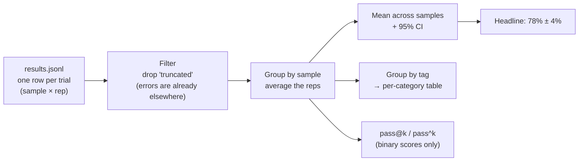
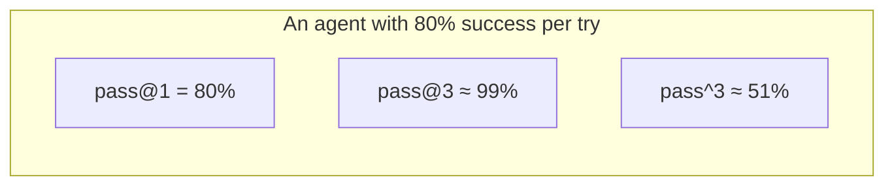
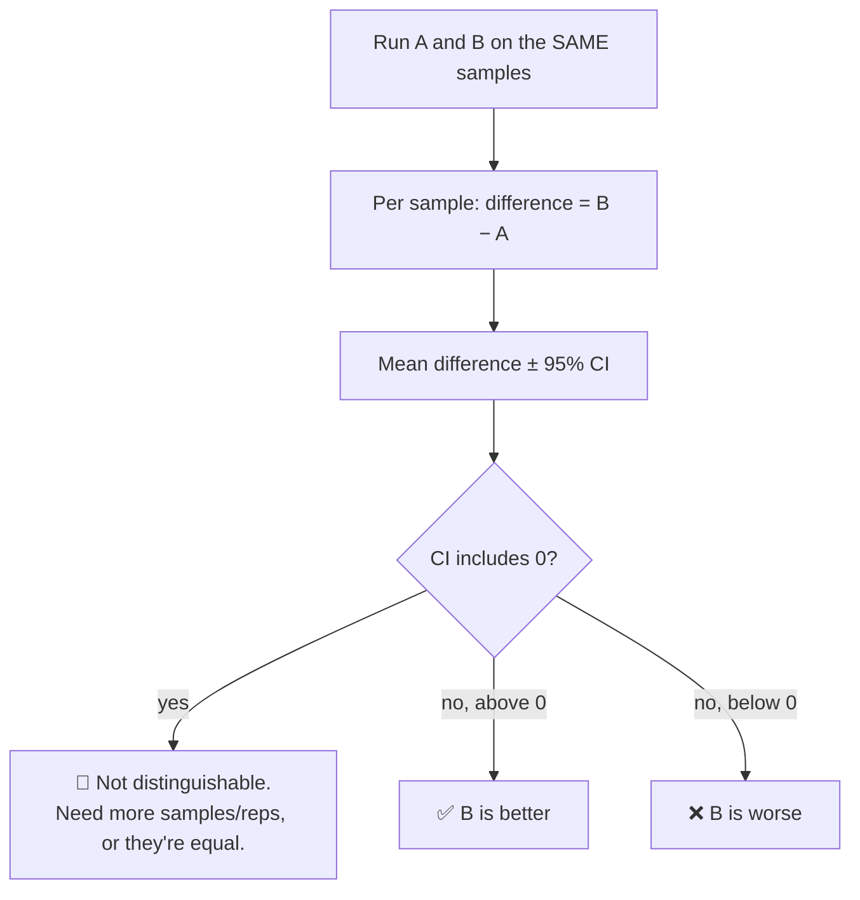
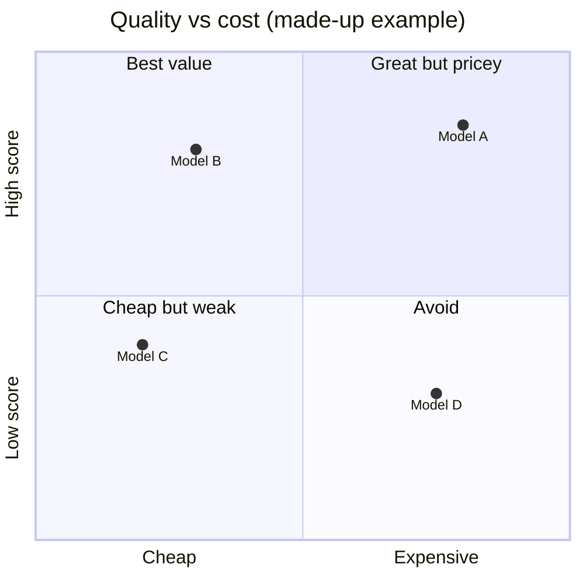

# Chapter 8: Metrics: Numbers You Can Trust

[← Chapter 7](07-graders.md) · [Contents](../README.md) · Next: [Chapter 9: The runner →](09-the-runner.md)

After grading you have hundreds of little scores. Metrics turn them into a few numbers people can make decisions with, **honestly**, with uncertainty included. This chapter applies the statistics from [Chapter 2](../part-1-prerequisites/02-statistics-you-need.md) to real eval results.

---

## 8.1 From rows to a headline



In code (from Part 3):

```python
by_sample = per_sample_scores(rows)                      # {"math-01": [1, 1, 0], ...}
sample_means = [mean(s) for s in by_sample.values()]     # one number per question
score, ci = mean_and_ci(sample_means)                    # mean ± 1.96 × SE
```

> 🔑 **Key idea:** The unit of evidence is the **sample** (the question), not the trial. Average reps within a sample first, then compute the error bar across samples.

---

## 8.2 The report every eval should produce

| Section | Why |
|---------|-----|
| **Headline ± CI**, with sample count | The main answer, with honesty about uncertainty |
| **What was run**: model, settings, dataset version, reps | So readers know what the number means |
| **Status counts**: ok / truncated / refusal / errors | Tells you whether plumbing problems affected the run |
| **Per-category breakdown** | "Great at maths, bad at code" is more useful than one average |
| **Reliability**: pass@k and pass^k | Capability vs. consistency |
| **Cost & latency** | Quality is only half of the decision |
| **Baseline(s)** | A dumb baseline and/or the previous version, for context |
| **List of failures with links to transcripts** | So someone can actually look |

---

## 8.3 pass@k explained

**pass@k** answers: "if the model gets k tries, what's the chance **at least one** is correct?" It matters when you can check answers automatically and retry, like generating code and running the tests.

The naive way (run exactly k tries, see if any passed) is noisy. The standard way, from the paper that introduced the HumanEval benchmark, is:
1. Run **n** tries per problem (n ≥ k), and count the **c** correct ones.
2. Ask: "if I picked k of these n tries at random, what's the chance that **all k** are failures?" That's `C(n−c, k) / C(n, k)`.
3. pass@k = 1 − that.

```python
def pass_at_k(n, c, k):
    if n - c < k:           # not enough failures to fill k picks → at least one success guaranteed
        return 1.0
    return 1.0 - math.comb(n - c, k) / math.comb(n, k)
```

Worked example: n = 5 tries, c = 2 correct.
- pass@1 = 1 − C(3,1)/C(5,1) = 1 − 3/5 = **40%**
- pass@2 = 1 − C(3,2)/C(5,2) = 1 − 3/10 = **70%**

Then average pass@k across all problems.

## 8.4 pass^k explained

**pass^k** answers: "what's the chance **all k** tries are correct?" This is **reliability**. It was popularised by the tau-bench agent benchmark, because a customer-service agent that works "usually" isn't good enough.

```python
def pass_hat_k(n, c, k):
    return math.comb(c, k) / math.comb(n, k)    # pick k tries: all must be from the c successes
```

Worked example: n = 5, c = 4 → pass^2 = C(4,2)/C(5,2) = 6/10 = **60%**.



> ⚠️ pass@k and pass^k need **binary** (0/1) scores and the **same number of tries** for every sample.

---

## 8.5 Comparing two systems (the paired test)

The question you'll ask most often: **"Is B better than A?"**



Part 3's `compare` command does this (illustrative numbers):

```
$ python mini_eval.py compare runs/prompt_v1 runs/prompt_v2
Shared samples: 100
A score 71.0% · B score 76.5%
Difference B − A: +5.5% ± 3.9% (95% CI)
→ B is better, and the difference is bigger than the noise.
```

Also **look at which samples changed**. If B fixed 10 cases and broke 5 others, you want to know about the 5.

---

## 8.6 Quality is half the story: cost and latency

Two models can score the same while one is 5× cheaper. Record per trial:

| Metric | How to measure it properly |
|--------|---------------------------|
| **Tokens** | From the API response's `usage` field. Never estimate from text length. |
| **Cost** | tokens × the **actual** model's prices (input, output, cache reads). **Include the judge's cost** separately. |
| **Latency** | Time for the successful call. Don't include retry waits, or the variant that happened to hit rate limits looks slower. |
| **Tool calls / steps** | For agents: efficiency, and a warning sign if it's huge |

Report **absolute numbers first** ("$0.031 per task, 19.8 s") and only then relative ones ("33% faster"). "33% faster" means little without knowing if it's 2 s or 20 s.



---

## 8.7 Common metric mistakes

| Mistake | Why it's wrong | Fix |
|---------|---------------|-----|
| Counting timeouts/API errors as 0 | Blames the model for plumbing | Keep errors in a separate file; report the count |
| Counting truncated answers as wrong | They were cut off, not wrong | Mark as `truncated`, exclude from the mean, fix `max_tokens` |
| Treating reps as independent samples | Makes error bars look far too small | Average within sample first |
| Reporting only the mean | Hides uncertainty | Always give the CI and the sample count |
| One blended score for everything | Hides what's actually failing | Per-category and per-criterion breakdowns |
| Accuracy on unbalanced yes/no data | "Always no" looks great | Precision/recall + a dumb baseline |
| Comparing runs with different settings or dataset versions | Apples vs. oranges | Check the configs match first |
| Trusting an aggregate you didn't recompute | Mean-of-sums bugs happen | Recompute the headline from the raw rows |

## 🧪 Try it

An agent was run 4 times on each of 3 tasks. Task A: 4/4 correct. Task B: 2/4. Task C: 0/4.
1. What's the headline score? (Average per task first.)
2. What's pass@2 for task B? (n=4, c=2, k=2.)
3. What's pass^2 averaged over all three tasks?

<details><summary>Answers</summary>

1. (1.0 + 0.5 + 0.0) / 3 = **50%**
2. 1 − C(2,2)/C(4,2) = 1 − 1/6 ≈ **83%**
3. Task A: C(4,2)/C(4,2) = 1. Task B: C(2,2)/C(4,2) = 1/6. Task C: 0. Average ≈ **39%**
</details>

## ✅ Chapter summary

- Average **reps within samples**, then compute **mean ± CI across samples**.
- A good report has: headline ± CI, config, status counts, categories, reliability, cost/latency, baselines, and failures with transcripts.
- **pass@k** (any of k) uses `1 − C(n−c,k)/C(n,k)`; **pass^k** (all of k) uses `C(c,k)/C(n,k)`.
- Compare systems with a **paired difference**; if the CI includes 0, you can't tell them apart.
- Measure **tokens, cost (including the judge), and latency** properly, and report absolute numbers.

[← Chapter 7](07-graders.md) · [Contents](../README.md) · Next: [Chapter 9: The runner →](09-the-runner.md)
