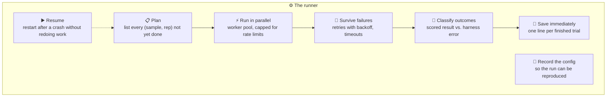
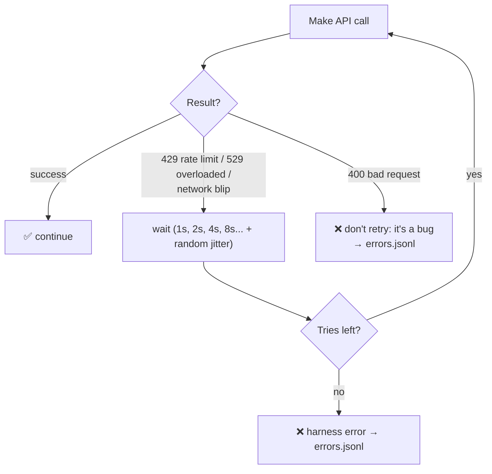
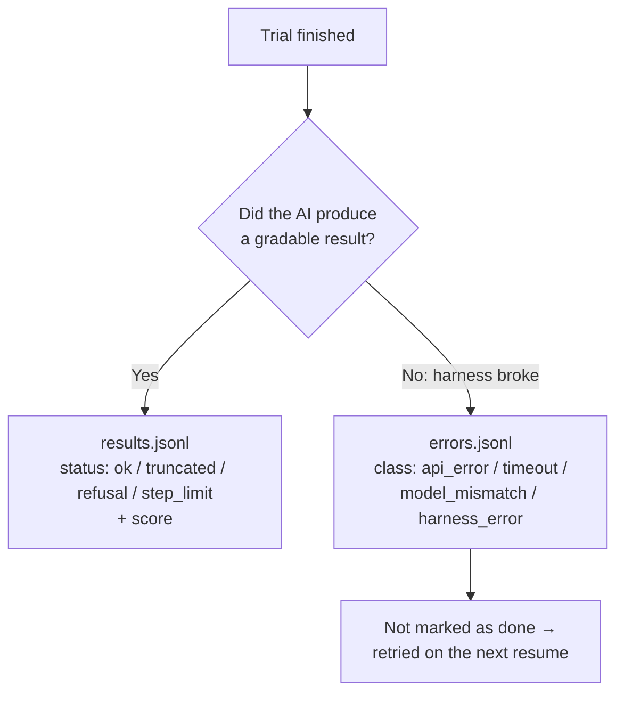
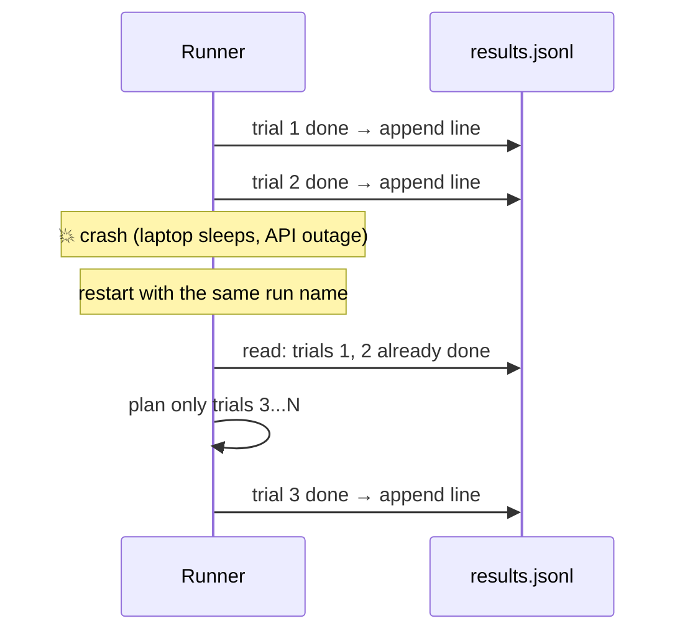

# Chapter 9: The Runner: Engineering for Scale

[← Chapter 8](08-metrics.md) · [Contents](../README.md) · Next: [Chapter 10: Sandboxes & environments →](10-sandboxes-and-environments.md)

The **runner** is the engine that pushes every (sample × rep) through the solver and grader. With 10 cases, a simple `for` loop is fine. With 10,000 agent trials that each take 5 minutes and cost money, the runner becomes serious software. This chapter covers what it must do.

---

## 9.1 The runner's jobs



---

## 9.2 Parallelism and rate limits

Run many trials at once, but not so many that you hit the API's rate limits.

```python
with ThreadPoolExecutor(max_workers=cfg.workers) as pool:
    futures = {pool.submit(run_one, s, rep, cfg): (s, rep) for s, rep in jobs}
    for future in as_completed(futures):      # handle each trial the moment it finishes
        ...
```

How to choose `workers`:
- Start low (4–8), watch for 429 errors, and increase.
- Agent trials are slow but make many calls each, so they may need **fewer** workers than you'd think.
- Some runners use a **token bucket** or semaphore to stay under tokens-per-minute limits precisely.

## 9.3 Retries, backoff, and timeouts



- **Retry only transient errors** (rate limits, overloads, network). A 400 "bad request" is a bug in your code; retrying just wastes time.
- **Backoff with jitter**: wait longer each time, plus a random wiggle so workers don't all retry at once. Official SDKs do this for you (`anthropic.Anthropic(max_retries=5)`).
- **Record retries.** Hidden retries make runs slower and more expensive than they look.
- **Hard time ceiling per trial.** A stuck agent or hung connection must not block a worker forever. When the ceiling hits, it's a **timeout error**, not a score of 0.

---

## 9.4 Errors are not wrong answers

> 🔑 **Key idea:** If a trial fails because of the **plumbing** (the network dropped, the API was overloaded, your grader crashed, the sandbox didn't start), that says nothing about the AI. Mixing these in as zeros **silently corrupts** your scores.



| Outcome | Where it goes | Counted in score? |
|---------|--------------|-------------------|
| Normal answer | results | ✅ yes |
| Refused | results (status `refusal`) | ✅ yes, and also counted separately |
| Agent hit the step limit | results (status `step_limit`) | ✅ yes: it failed the task |
| Cut off by `max_tokens` | results (status `truncated`) | ❌ excluded; fix your settings |
| API error after all retries | errors | ❌ no |
| Trial timed out | errors | ❌ no |
| Wrong model served | errors | ❌ no |
| Grader crashed | errors | ❌ no |

Always show the **error count** in the report. If 20% of trials errored, the headline isn't trustworthy even if it looks fine.

---

## 9.5 Save as you go, and resume



- **Append each result the moment it finishes**, and `flush()`, so a crash loses at most the in-flight trials.
- **Resume key = (sample id, rep).** On restart, skip keys already in `results.jsonl`. Errors are *not* skipped, so they get retried.
- **Refuse to resume with a different config.** Mixing half a run on model A with half on model B would be nonsense. Part 3's runner checks that `config.json` matches.

---

## 9.6 Reproducibility: record everything

Save a `config.json` with every run:

```json
{
  "harness_version": "1.0",
  "dataset": "datasets/basics.jsonl", "dataset_sha": "b681e4aae8c1",
  "solver": "chat", "model": "claude-opus-5-5", "effort": "medium", "max_tokens": 16000,
  "judge_model": "claude-sonnet-5-5", "reps": 3
}
```

Also:
- **Pin dependency versions** (`requirements.txt` with exact versions, Docker image tags).
- **Keep dataset and grader versions together.** A grader change means old scores aren't comparable.
- **Fix random seeds** for anything random in *your* code (shuffling, sampling cases).
- **Commit the harness to git** and record the commit.

---

## 9.7 Saving money

Evals can get expensive, especially agent evals and LLM judges.

| Technique | How it helps |
|-----------|-------------|
| **Pilot first** | Run 5–10 cases, check everything works, measure the real cost per case, *then* run the full set |
| **Resume instead of restart** | Never pay twice for finished trials |
| **Cache what doesn't change** | E.g. generated tests, reference outputs, the judge's verdict for identical inputs |
| **Prompt caching** | The shared start of every request (system prompt, tools) is cheaper when repeated |
| **Batch APIs** | Many providers offer ~50% off for non-urgent bulk requests that finish within hours |
| **Skip the judge on empty answers** | An empty answer is a 0; don't pay a judge to say so |
| **Trim for iteration** | While iterating, run only the cases that discriminate (not always-pass/always-fail); run the full set at the end |
| **Cheaper judge** | A smaller judge model is often fine for simple rubric checks (calibrate it first!) |

Estimate cost from the **pilot's measured token usage**, not guesses:
```
cost ≈ cases × reps × (median tokens per trial × price) + judge cost
```

---

## 9.8 Progress and observability

Long runs need feedback. Print a line per finished trial (`[57/300] ✅ code-02 rep 1: 1.00`), show running cost, and make it easy to open a transcript from the report. Big harnesses add live dashboards, but a clear log line gets you most of the way.

## ✅ Chapter summary

- The runner **plans, parallelises, retries, classifies, saves, resumes, and records**.
- Cap concurrency for **rate limits**; retry **transient** errors with **backoff + jitter**; enforce a **hard time ceiling** per trial.
- **Errors are not wrong answers**: keep them in `errors.jsonl`, report the count, and retry them on resume.
- **Append results as they finish**; resume by **(sample, rep)**; refuse to mix configs.
- Save a **config** with every run; pin versions; commit to git.
- Control cost with **pilots, caching, batching, and trimming**, estimated from measured usage.

[← Chapter 8](08-metrics.md) · [Contents](../README.md) · Next: [Chapter 10: Sandboxes & environments →](10-sandboxes-and-environments.md)
