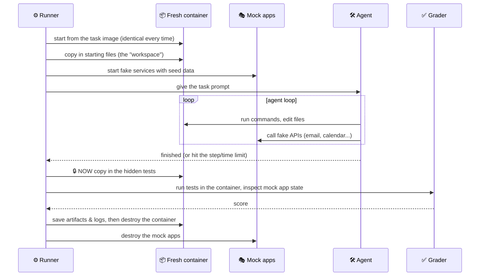
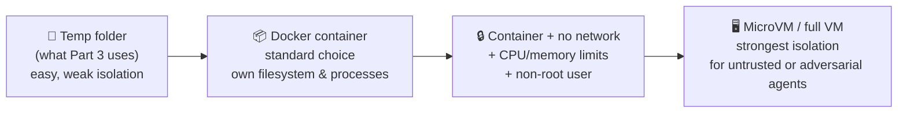
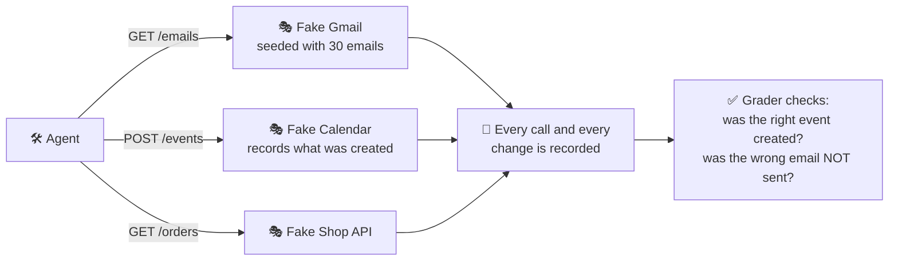

# Chapter 10: Sandboxes & Environments: Evaluating Agents

[← Chapter 9](09-the-runner.md) · [Contents](../README.md) · Next: [Chapter 11: Can you trust your eval? →](11-trust-your-eval.md)

Evaluating a model means checking text. Evaluating an **agent** means letting an AI loose in a world (files, terminals, apps), then inspecting that world afterwards. To do that fairly and safely, every trial needs its own **sandbox**. This chapter is about building those worlds.

---

## 10.1 Why agents need sandboxes

| Need | Without a sandbox | With a sandbox |
|------|-------------------|----------------|
| **Safety** | The agent runs `rm -rf` on *your* laptop | It deletes files in a throwaway container |
| **Fairness** | Trial 2 sees files left behind by trial 1 | Every trial starts from the identical state |
| **Reproducibility** | "Works on my machine" | Same image, same data, same result |
| **Hidden answers** | The agent might find the answer key on disk | Grading material is added only *after* the agent stops |
| **Realism** | Can't safely let it send emails or edit a calendar | Fake (mock) apps behave like real ones |

---

## 10.2 The lifecycle of one agent trial



> 🔑 **Key idea:** The grading material enters the world **after** the agent leaves it. The answers aren't hidden by a "please don't look" instruction; they simply aren't there yet.

---

## 10.3 Levels of isolation



Docker options that matter for evals:

```bash
docker run --rm \
  --network none \          # no internet: no looking up answers, no leaking data
  --memory 4g --cpus 2 \    # a runaway process can't take down the machine
  --user 1000:1000 \        # don't run as root
  -v "$PWD/task_files:/workspace" \
  task-image:v1 ...
```

Between "no network" and "full internet", many harnesses use an **allow-list**: the agent can reach the model API (often through a proxy) and the mock apps, and nothing else. WildClawBench puts agent containers on an internal network where the only exits are a model proxy (a LiteLLM "sidecar") and the mock API services.

---

## 10.4 Mock services: fake apps that behave like real ones

Real agents use Gmail, Slack, calendars, databases, payment systems. You can't let an eval send real emails, so you build **mocks**: small fake servers with the same API shape and seeded data.



Good mock services:
- **Match the real API** closely enough that the agent's skills transfer.
- **Record every call and state change**, so graders can check what happened.
- **Reset** to seed data for every trial.
- Can include **distractors** (irrelevant services) to test whether the agent picks the right tool.

### Drift: changing the world mid-task

Advanced agent benchmarks **change the world during the task** to test whether the agent notices. For example, a meeting gets moved after the agent read the calendar, or a file changes between turns. WildClawBench calls these **injections/mutations**. They test a very real skill: not trusting stale information.

---

## 10.5 Grading the environment

After the agent finishes, graders can inspect:

| Check | Example |
|-------|---------|
| **Files** | Does `summary.json` exist with the right totals? |
| **Hidden tests** | Do the unit tests pass now? |
| **Regression tests** | Do the tests that passed before still pass? |
| **Diff** | Were only the intended files changed? |
| **Mock app state** | Was exactly one calendar event created, at the right time? |
| **Forbidden actions** | Was the "delete all" endpoint called? Was the secret printed? |
| **Budget** | Steps, tool calls, time, tokens |

A snapshot trick (used by WildClawBench): record every file's size and modification time **before** the agent runs, then collect only the files that changed. That gives you exactly **what the agent produced**.

---

## 10.6 Environment pitfalls

| Pitfall | Symptom | Fix |
|---------|---------|-----|
| **Missing dependency** | Every model fails the same task | Run the **reference solution** in the environment. It must pass. |
| **Leftover state** | Scores depend on run order | Fresh container/folder per trial, always |
| **Answer on disk** | Suspiciously high scores; transcripts show the agent `cat`-ing the answer | Add grading files only after the agent stops |
| **Leftover git history** | Agent runs `git log` and finds the fix | Strip or rewrite history in task repos |
| **Internet access** | Agent finds the benchmark solution online | `--network none` or an allow-list |
| **Flaky environment** | Same agent, same task, random pass/fail | Pin versions, remove timing dependencies, fix seeds |
| **Too-tight limits** | Agents "fail" by running out of steps | Check how many trials hit limits; decide on purpose |
| **Secrets in the sandbox** | API keys end up in transcripts | Keep real credentials outside; route model calls through a proxy |

---

## 10.7 Packaging tasks: the task bundle

Agent eval frameworks usually package each task as a **self-contained bundle** so anyone can run it:

```
my-task/
├── task.toml         ← metadata: time limit, difficulty, category
├── instruction.md    ← the prompt the agent sees
├── environment/
│   └── Dockerfile    ← the world
├── solution/
│   └── solve.sh      ← reference solution (proves it's solvable; used for oracle runs)
└── tests/
    └── test.sh       ← hidden grading, run after the agent finishes
```

This is roughly the shape used by **Harbor** (the framework behind Terminal-Bench), and the WildClawBench fork converts graded runs into this kind of bundle. The `solution/` folder is what makes the most important sanity check possible: run the reference solution through the whole pipeline and confirm it scores 100% (Chapter 11).

## ✅ Chapter summary

- Agents need **sandboxes** for safety, fairness, reproducibility, hidden answers, and realism.
- Trial lifecycle: **fresh world → agent runs → hidden tests added → grade the end state → destroy**.
- Isolation levels: **temp folder → container → container with no network and resource limits → VM**.
- **Mock services** imitate real apps, record every call, reset per trial, and can **drift** mid-task.
- Grade **files, tests, diffs, app state, forbidden actions, and budgets**.
- Always run the **reference solution** in the environment to prove each task is solvable.

[← Chapter 9](09-the-runner.md) · [Contents](../README.md) · Next: [Chapter 11: Can you trust your eval? →](11-trust-your-eval.md)
