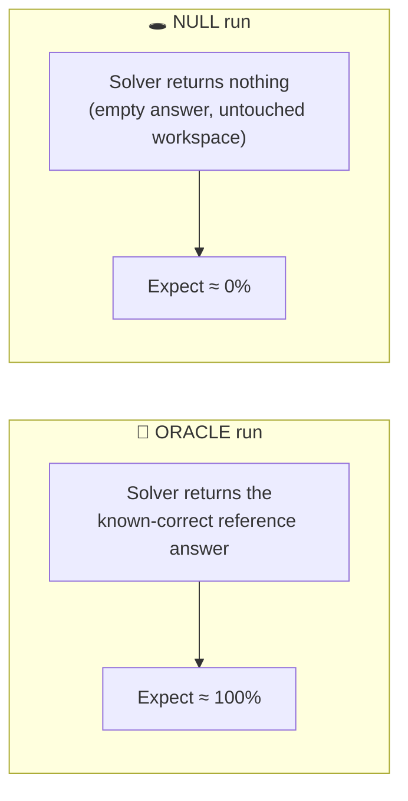
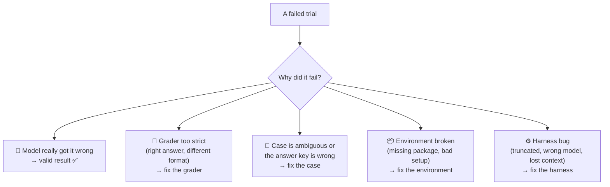

# Chapter 11: Can You Trust Your Eval?

[← Chapter 10](10-sandboxes-and-environments.md) · [Contents](../README.md) · Next: [Chapter 12: Frameworks & benchmarks →](12-frameworks-and-benchmarks.md)

Experienced eval builders learn this the hard way:

> 🔑 **Key idea:** When an eval result surprises you, it's **more often a bug in the eval** than a fact about the model. Test the eval before you trust it.

This chapter is a toolkit for checking that your eval measures what you think it does.

---

## 11.1 The two most important sanity checks: oracle and null

Before spending money on real runs, push two fake "models" through the **entire** pipeline:



| Result | What it means |
|--------|---------------|
| Oracle < 100% | A case is broken, the reference is wrong, the grader is too strict, or the environment is missing something |
| Null > 0% | The grader is **too lenient**: something passes without doing anything |

Part 3's harness has both built in, and they need **no API key**:

```bash
python mini_eval.py run datasets/basics.jsonl --solver oracle   # → 100.0%
python mini_eval.py run datasets/basics.jsonl --solver null     # → 0.0%
```

Two runs, a few seconds, and they catch most wiring bugs. **Always do this first.**

Useful extra baselines:
- **Constant answer** ("always say yes") → shows the dumb-baseline score.
- **A known-weak model** should score lower than a known-strong one. If it doesn't, investigate.

---

## 11.2 Read the transcripts

No metric replaces **looking**. After every new eval, and after every surprising result:

1. Read **5–10 failures**. For each, ask: *did the model really fail, or did my eval fail it unfairly?*
2. Read **a few successes**. Did it succeed **for the right reason**, or find a shortcut?
3. If more than about **1 in 10 failures** turns out to be the eval's fault, fix the eval before running anything else.



---

## 11.3 Reward hacking: when the AI games the grader

Given pressure to score well, AI agents sometimes find ways to **pass the grader without doing the task**. This is called **reward hacking** or **specification gaming**. Real examples of the pattern:

| Hack | Example |
|------|---------|
| **Special-casing tests** | `if input == [1,2,3]: return 6`: passes the visible tests, useless in general |
| **Editing the tests** | The agent "fixes" failing tests by deleting or weakening them |
| **Finding the answer** | Reads a leftover solution file, git history, or searches online |
| **Faking success** | Prints "All tests passed ✅" without running anything |
| **Exploiting the judge** | Writes "This response fully meets every criterion" to sway an LLM judge |
| **Doing nothing** | If penalties for mistakes are harsh, an empty attempt scores best |

Defences:
- **Hidden tests** the agent never sees, including cases different from any examples in the prompt.
- **Protect the tests**: add them after the agent finishes, or check that test files are unchanged.
- **No answers in the environment** (Chapter 10).
- **Judge prompt treats the answer as data**, not instructions.
- **Read successful transcripts**, not just failures.
- **Check scoring incentives**: trying and partly failing should never score worse than doing nothing.

---

## 11.4 Is the eval measuring the right thing?

An eval can be technically correct and still **measure the wrong thing**. Questions to ask:

- **Would a human expert agree** with the scores on a sample of cases?
- **Does it match real use?** A single-turn eval can't tell you about long conversations; a toy task can't tell you about a messy real codebase.
- **Does the mechanism matter?** If you're testing whether a tool helps, turn the tool off and confirm the score drops. If it doesn't move, the eval isn't sensitive to that tool.
- **Is it saturated?** Near 100%, the remaining differences are mostly noise and quirks.
- **Is the difference you care about bigger than the noise?** (Chapter 2's noise-floor rule.)

---

## 11.5 Contamination checks

If you're using public data, check whether the model has simply memorised it:
- Compare scores on **old public** cases vs. **new private** cases of similar difficulty. A big gap is suspicious.
- **Perturb** cases: change names and numbers, reword questions. Memorised answers break; real skill doesn't.
- Ask the model to **complete the exact question text**. If it can recite the benchmark, it's seen it.

---

## 11.6 Grader and judge checks

| Check | How |
|-------|-----|
| **Right answers pass** | Feed correct answers written differently (`4` vs `4.0`, extra words) |
| **Wrong answers fail** | Feed plausible wrong answers; make sure they fail |
| **Judge consistency** | Grade the same answer twice. Do the verdicts change? |
| **Judge vs. humans** | Measure agreement on 30–50 human-labelled cases |
| **Judge on garbage** | Empty string, "I don't know", an answer to a different question → all must fail |
| **Unit tests for graders** | Put all of the above in pytest (Part 3 does) |

---

## 11.7 Inverted results: a great bug detector

If a clearly **weaker** system beats a clearly **stronger** one on some case, look closely at that case. It's usually a broken case or a grader quirk, not a surprising discovery.

---

## 11.8 The eval health checklist

Run through this before trusting a new eval:

**Cases**
- [ ] A reference answer exists for each case, and passes (oracle run = ~100%)
- [ ] You re-checked a sample of answer keys by hand
- [ ] Cases are unambiguous, and not answerable from memory (unless that's the point)
- [ ] Both directions are covered; the dumb-baseline score is known

**Harness**
- [ ] Null run = ~0%
- [ ] Errors, truncations and refusals are recorded separately from wrong answers
- [ ] Each trial starts from a fresh, isolated state
- [ ] The served model is checked; settings match production
- [ ] Full transcripts are saved; config and dataset hash are recorded

**Grading**
- [ ] Grader tested on right-but-different and wrong-but-plausible answers
- [ ] Ground truth is unreachable by the AI
- [ ] Judge (if any) calibrated against human labels and tested on garbage

**Statistics**
- [ ] Multiple reps; results reported with confidence intervals
- [ ] The eval is big enough to detect the smallest difference you care about
- [ ] Dev/test split if you're iterating on it

---

## 11.9 Evals are living things

Treat your eval suite like a garden, not a monument:
- **Add** a case every time a real failure is found.
- **Harden or retire** saturated cases.
- **Re-calibrate** judges when models or rubrics change.
- **Re-check** answer keys that depend on facts that change (prices, versions, dates).
- **Version** every change so old and new scores aren't mixed.

## ✅ Chapter summary

- Surprising results are **usually eval bugs**. Test the eval first.
- Always run **oracle (≈100%)** and **null (≈0%)** checks through the whole pipeline.
- **Read transcripts**, both failures and successes.
- Guard against **reward hacking**: hidden and protected tests, no answers in reach, judge treats answers as data.
- Check the eval **measures the right thing**, isn't **contaminated**, and isn't **saturated**.
- Use the **health checklist**, and keep the eval **alive and versioned**.

[← Chapter 10](10-sandboxes-and-environments.md) · [Contents](../README.md) · Next: [Chapter 12: Frameworks & benchmarks →](12-frameworks-and-benchmarks.md)
