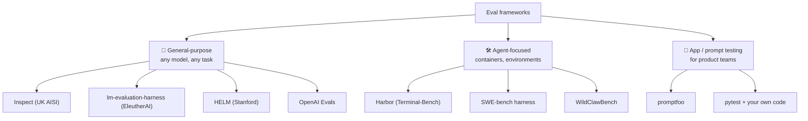
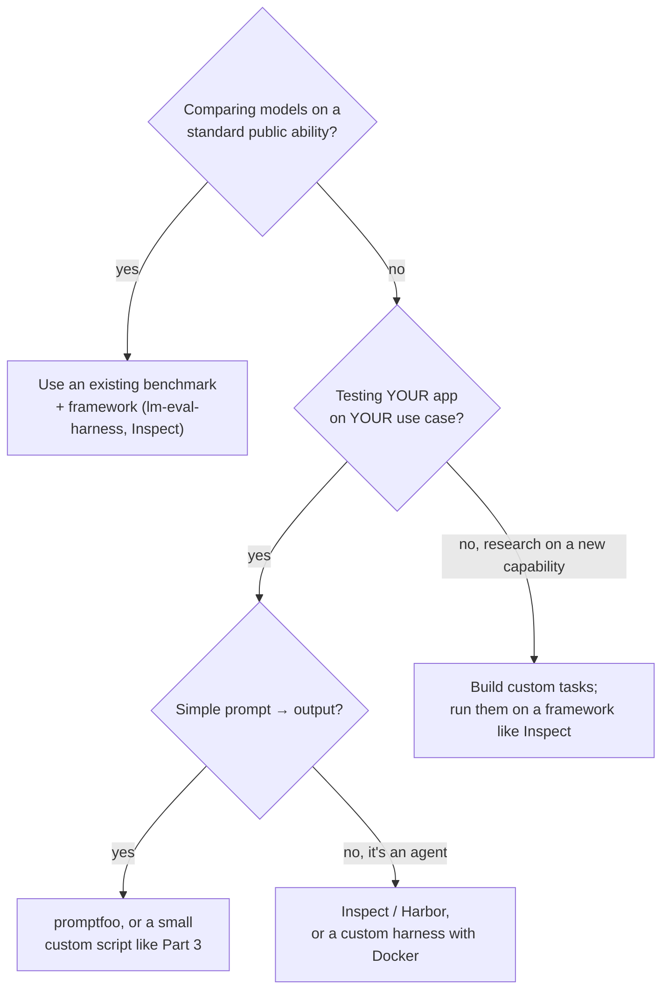

# Chapter 12: Frameworks & Famous Benchmarks

[← Chapter 11](11-trust-your-eval.md) · [Contents](../README.md) · Next: [Chapter 13: Build your own →](../part-3-build/13-build-your-own.md)

You don't always have to build an eval harness from scratch. This chapter surveys existing **frameworks** (harness software) and **benchmarks** (standard test sets), and helps you decide when to build your own.

> ⚠️ This field moves very fast. Treat this as a map, not a manual: check each project's own docs for current details.

---

## 12.1 Eval frameworks

| Framework | What it is | Good for |
|-----------|-----------|----------|
| **Inspect** (UK AI Security Institute) | Python framework built around *Dataset → Solver → Scorer*; supports agents, tools, sandboxes, and has a log viewer | Serious capability and safety evals, including agents |
| **lm-evaluation-harness** (EleutherAI) | Runs hundreds of standard academic benchmarks against many model backends, configured with YAML | Comparing base models on standard benchmarks |
| **HELM** (Stanford CRFM) | "Holistic" evaluation across many scenarios and metrics (accuracy, calibration, bias...) | Broad, multi-dimensional model comparison |
| **OpenAI Evals** | A framework and registry of evals | Model-graded and templated evals |
| **promptfoo** | CLI and YAML test cases for prompts and apps, with assertions and LLM grading | Product teams testing prompts in CI |
| **Harbor** | Framework for running agents on containerised tasks; the task format behind Terminal-Bench | Agent evals at scale |
| **SWE-bench harness** | Runs agents' patches against real repos' tests in Docker | Coding agents |

All of them are built from the parts you learned in Chapter 4. If you understand those, you can learn any framework in an afternoon.

---

## 12.2 Famous benchmarks, by what they measure

| Area | Benchmarks | What they test | How they're graded |
|------|-----------|----------------|--------------------|
| **Knowledge** | MMLU, MMLU-Pro | Multiple-choice questions across dozens of subjects | Exact match on the letter |
| **Hard reasoning** | GPQA, Humanity's Last Exam | Expert-level science and academic questions | Exact match |
| **Maths** | GSM8K, MATH, AIME problems | Word problems to competition maths | Numeric / exact answer |
| **Code (functions)** | HumanEval, MBPP | Write a function from a description | Hidden unit tests; pass@k |
| **Code (real repos)** | SWE-bench (and SWE-bench Verified) | Fix real GitHub issues in real projects | The repo's own tests, run after the patch |
| **Terminal tasks** | Terminal-Bench | Complete tasks in a Linux terminal | Tests on the container's end state |
| **Tool-using agents** | tau-bench | Customer-service agent with a simulated user and policies | Final database state; pass^k |
| **General assistants** | GAIA | Multi-step questions needing search and tools | Exact final answer |
| **Web & computers** | WebArena, OSWorld | Use websites and desktop apps | End-state checks |
| **Real-world personal agents** | WildClawBench | 60 long, multimodal tasks in a live agent environment, across 4 agent harnesses | Hidden tests + rubric judges, injected after the run |
| **Abstract reasoning** | ARC-AGI | Visual pattern puzzles | Exact grid match |

Notice the pattern: **the more "agentic" the benchmark, the more it relies on sandboxes and end-state grading.**

### Lessons the famous benchmarks teach

- **SWE-bench Verified** exists because many original SWE-bench tasks turned out to be ambiguous or unsolvable. Humans reviewed the tasks and kept a validated subset. (Lesson: *check your cases*, Chapter 5.)
- **HumanEval** introduced the unbiased **pass@k** estimator. (Chapter 8.)
- **tau-bench** introduced **pass^k**, because agents that work "usually" aren't reliable enough. (Chapter 8.)
- **MMLU** and **GSM8K** are close to **saturated** for top models, which is why harder sets (MMLU-Pro, GPQA, Humanity's Last Exam) appeared. (Chapter 5.)
- **WildClawBench** runs the **same tasks across four agent harnesses**, separating model skill from harness skill.

---

## 12.3 Build or use?

**Public benchmarks tell you about models in general. Your own eval tells you about your product.** Most teams need both, and the second matters more for day-to-day decisions.

Reasons to build your own harness:
- Your tasks need a special environment (your app, your APIs, your data).
- You need tight integration with your codebase and CI.
- You want to deeply **understand** evals (that's why Part 3 exists!).

Reasons to use a framework:
- Standard benchmarks are already implemented and validated.
- Logging, viewers, sandboxing and parallelism come for free.
- Results are comparable with other people's.

## ✅ Chapter summary

- Frameworks: **Inspect**, **lm-evaluation-harness**, **HELM**, **OpenAI Evals**, **promptfoo**, **Harbor**. All are Dataset → Solver → Grader → Metrics underneath.
- Benchmarks span **knowledge, reasoning, maths, code, terminals, tool use, web and computer use, and real-world agents**.
- Famous benchmarks teach the lessons of this guide: **validate cases, pass@k, pass^k, saturation, harness effects**.
- Use **public benchmarks** for general model comparison; build **your own evals** for your product.

[← Chapter 11](11-trust-your-eval.md) · [Contents](../README.md) · Next: [Chapter 13: Build your own →](../part-3-build/13-build-your-own.md)
