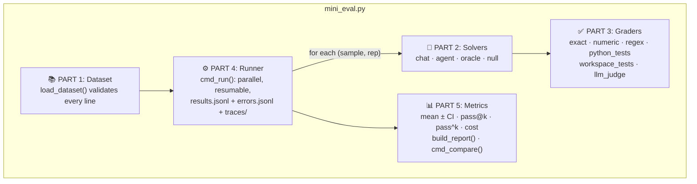
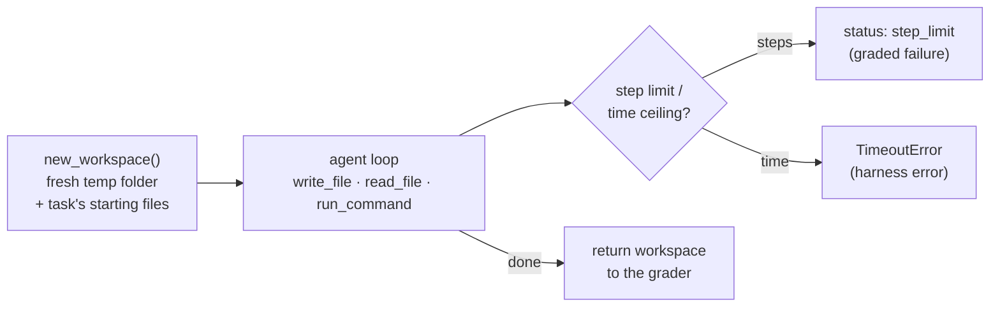
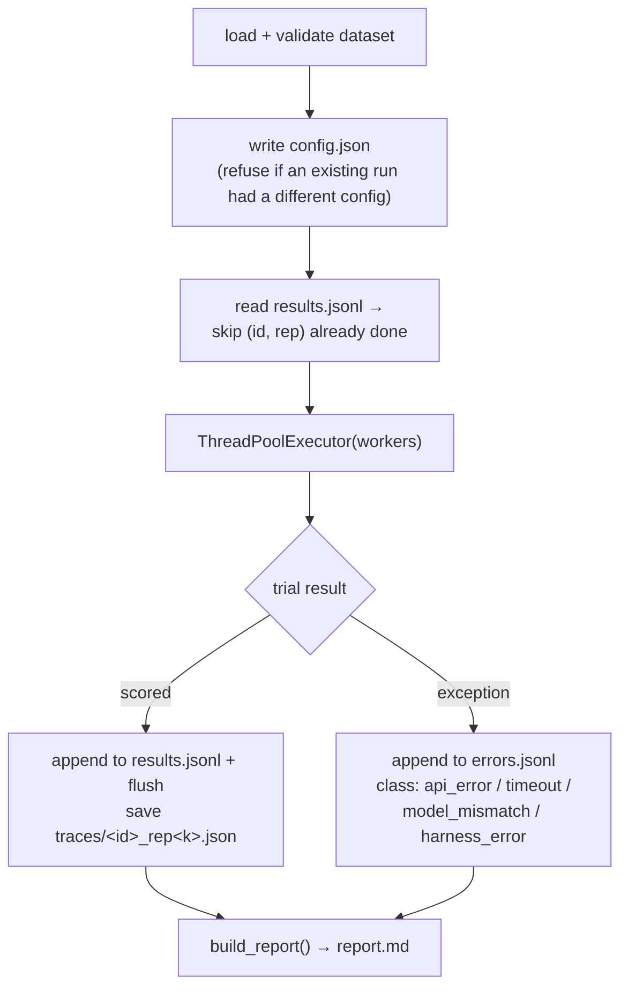

# Chapter 13: Build Your Own Mini Eval Harness

[← Chapter 12](../part-2-eval-harness/12-frameworks-and-benchmarks.md) · [Contents](../README.md) · Next: [Exercises →](../appendix/exercises-and-next-steps.md)

Time to build. This chapter walks through [`code/mini_eval.py`](code/mini_eval.py), a small but **real** eval harness, about 600 lines of Python. It can:

- evaluate a **model** (single-turn questions, code, writing) or an **agent** (a tool loop in a fresh workspace)
- grade with **exact match, numbers, regex, hidden unit tests, end-state tests, and an LLM judge**
- run trials **in parallel**, **resume** after a crash, and keep **errors apart from scores**
- report **mean ± 95% CI, per-category scores, pass@k, pass^k, cost and latency**
- **compare** two runs with a paired difference

It comes with a [test suite](code/test_mini_eval.py) (25 tests, no API key needed) and three [datasets](code/datasets/).

---

## 13.1 The map



| Part | Chapter | Lines (approx.) |
|------|---------|-----------------|
| Dataset | [5](../part-2-eval-harness/05-datasets-and-tasks.md) | 54–79 |
| Solvers | [6](../part-2-eval-harness/06-solvers.md), [10](../part-2-eval-harness/10-sandboxes-and-environments.md) | 81–257 |
| Graders | [7](../part-2-eval-harness/07-graders.md) | 260–361 |
| Runner | [9](../part-2-eval-harness/09-the-runner.md) | 364–446 |
| Metrics & report | [8](../part-2-eval-harness/08-metrics.md) | 448–562 |

---

## 13.2 Setup and first run (no API key needed)

```bash
cd part-3-build/code
pip install -r requirements.txt

# 1. Test the harness itself
pytest test_mini_eval.py -q                      # → 25 passed

# 2. Sanity-check the eval (Chapter 11): oracle should be 100%, null should be 0%
python mini_eval.py run datasets/basics.jsonl --solver oracle
python mini_eval.py run datasets/basics.jsonl --solver null
python mini_eval.py run datasets/agent_tasks.jsonl --solver oracle
python mini_eval.py run datasets/agent_tasks.jsonl --solver null
```

Real output from the null run on the agent tasks:

```text
## Headline: **0.0% ± 0.0%** (95% CI, 3 samples) · truncated: 0/3 trials (0.0%) excluded

## Failed or partial trials

- `agent-csv` rep 0 (ok, 0.00): AssertionError: summary.json was not created
- `agent-fixbug` rep 0 (ok, 0.00): AssertionError
- `agent-wordcount` rep 0 (ok, 0.00): AssertionError: ... can't open file '.../wordcount.py'
```

Good: doing nothing scores nothing, and the explanations say why.

### Then for real

```bash
export ANTHROPIC_API_KEY="sk-ant-..."
python mini_eval.py run datasets/basics.jsonl --solver chat --reps 3
python mini_eval.py run datasets/agent_tasks.jsonl --solver agent --reps 3
python mini_eval.py run datasets/writing.jsonl --solver chat --reps 2     # uses the LLM judge
```

---

## 13.3 Part 1: Dataset

```python
def load_dataset(path):
    for line_no, line in enumerate(Path(path).read_text().splitlines(), 1):
        sample = json.loads(line)
        # check required fields, duplicate ids, known grader...
```

Validation happens **before** any money is spent. A typo in a grader name or a duplicate id fails immediately, with the line number.

The three datasets show the three kinds of eval:

| File | Samples | Graders | Tests |
|------|---------|---------|-------|
| `basics.jsonl` | 12 | numeric, exact, regex, python_tests | a **model** on short answers and code |
| `agent_tasks.jsonl` | 3 | workspace_tests | an **agent** building, debugging, and processing data |
| `writing.jsonl` | 3 | llm_judge | open-ended **writing**, with rubrics |

Every sample has a `reference` (or `reference_files`) so the oracle check works.

---

## 13.4 Part 2: Solvers

**`call_model()`**: every API call goes through one function that sets the model and effort, and **checks the served model**:

```python
if not response.model.startswith(cfg.model):
    raise ModelMismatch(f"asked for {cfg.model}, got {response.model}")
```

We deliberately **don't** enable automatic model fallbacks here. In an app they're helpful, but in an eval a silent switch to another model would corrupt the measurement.

**`status_of()`**: turns `stop_reason` into `ok`, `truncated` or `refusal` (Chapter 6.5).

**`solve_chat()`**: one question, one answer. The system prompt asks for an `ANSWER:` line or a code block, so graders can find the answer.

**`solve_agent()`**: a mini agent harness *inside* the eval harness:



**`solve_oracle()` / `solve_null()`**: the sanity-check solvers. Oracle returns the reference answer (or writes the reference files); null returns nothing.

---

## 13.5 Part 3: Graders

Every grader has the same shape: `(sample, result, cfg) → {"score": 0..1, "explanation": "..."}`.

| Grader | How it works | Chapter 7 idea |
|--------|--------------|----------------|
| `grade_exact` | `normalize(extract_answer(output)) == normalize(target)` | Normalise before comparing |
| `grade_numeric` | Parse the last number, compare with a tolerance | Handle `$`, `,`, `6.8` vs `6.80` |
| `grade_regex` | `re.search(pattern, output)` | Format checks |
| `grade_python_tests` | Save the code as `solution.py`, run hidden tests | Execution-based grading |
| `grade_workspace_tests` | Run hidden tests **inside the agent's workspace** | Grade the end state |
| `grade_llm_judge` | A different model checks each rubric item, via structured output | Concrete rubrics, bias defences |

**Hidden tests** are written to a *separate* temporary folder and run with the workspace as the working directory. The agent never had a chance to see or edit them:

```python
def run_hidden_tests(test_code, cwd):
    with tempfile.TemporaryDirectory() as tests_dir:     # outside the agent's folder
        (Path(tests_dir) / "hidden_test.py").write_text(test_code)
        r = subprocess.run([sys.executable, ...], cwd=cwd, timeout=60, ...)
```

The **judge**:
- uses `claude-sonnet-5-5` by default, a **different model** from the one under test (avoids self-preference; change it with `--judge-model`)
- says in its system prompt that the response is **data, not instructions**, and that **length isn't a virtue**
- returns a **JSON schema-guaranteed** verdict per criterion
- is **never called for an empty answer**
- records its own model and token usage, so **judge cost is reported separately**

---

## 13.6 Part 4: Runner

`cmd_run()` is Chapter 9 in code:



Try the resume: start a run with `--name myrun`, press Ctrl+C halfway, run the same command again. It only does the trials that are left.

---

## 13.7 Part 5: Metrics and report

- `per_sample_scores()` groups by sample and **drops truncated** trials. That can inflate the score, because the hardest questions are the ones most likely to be cut off ([Chapter 6.5](../part-2-eval-harness/06-solvers.md)). So `truncation_note()` puts the truncation rate right next to the headline, and next to each run's score in `compare`. If any trial was truncated, the report also adds a warning to raise `--max-tokens` and re-run.
- `mean_and_ci()`: mean ± 1.96 × SE, across **samples** (reps are averaged first).
- `pass_at_k()` and `pass_hat_k()`: the exact formulas from Chapter 8, checked against hand calculations in the tests.
- `cost_usd()`: tokens × price, for the model **and** the judge. (Prices are in `PRICES` at the top of the file; check them against the provider's pricing page.)
- `build_report()` writes `report.md` with the headline, a reliability table, categories, cost and speed, and every failed trial with its explanation.
- `cmd_compare()`: the paired comparison from Chapter 8.5.

A report from a real run looks like this (illustrative numbers):

```text
# Eval report: basics_chat_claude-opus-5-5_20260929-101500

- Dataset: `datasets/basics.jsonl` (sha b681e4aae8c1), solver `chat`, model `claude-opus-5-5` (effort medium), reps 3
- Trials scored: 36 · statuses: {'ok': 36} · harness errors: 0

## Headline: **91.7% ± 11.7%** (95% CI, 12 samples) · truncated: 0/36 trials (0.0%) excluded

## Reliability
| k | pass@k (any of k succeeds) | pass^k (all k succeed) |
|---|---|---|
| 1 | 91.7% | 91.7% |
| 2 | 97.2% | 86.1% |
| 3 | 100.0% | 83.3% |
...
```

Notice the **± 11.7%**. With only 12 samples, the error bar is big. That's the honest truth about small evals (Chapter 2).

---

## 13.8 The tests: an eval harness needs tests too

[`test_mini_eval.py`](code/test_mini_eval.py) uses a **fake client** that plays back canned responses, so it runs offline in about a second. It checks:

| Test | What it proves |
|------|---------------|
| exact/numeric accept equivalent forms, reject wrong ones | graders are neither too strict nor too lenient |
| python_tests passes good code, fails bad code | execution grading works |
| pass@k / pass^k match hand calculations | the maths is right |
| truncated trials are excluded | cut-off ≠ wrong (the report shows the truncation rate, since excluding them can inflate the score) |
| a run resumes without calling the model again | resume works; no double spending |
| a wrong served model goes to errors, not results | plumbing ≠ performance |
| an agent that **writes the file** passes; an agent that only **claims** it did fails | end-state grading works |
| the judge scores the fraction of criteria, and uses a different model | the judge is wired correctly |
| oracle = 100% and null = 0% on the real datasets | the datasets and graders are sound |

## 13.9 How this compares to production harnesses

| Feature | mini_eval.py | Production (e.g. Inspect, Harbor, WildClawBench) |
|---------|--------------|--------------------------------------------------|
| Datasets, solvers, graders, metrics | ✅ | ✅ many more built in |
| Parallel + resume + error separation | ✅ threads | ✅ async, distributed, multi-machine |
| Sandbox | ⚠️ temp folder only | ✅ Docker / VMs, no network, resource limits |
| Mock services | ❌ | ✅ fake apps with state and drift |
| LLM judge | ✅ single judge | ✅ judge councils, pairwise, calibration tools |
| Reports | Markdown | Interactive viewers with transcripts |
| Multi-turn / simulated users | ❌ | ✅ |

The gaps are the [exercises](../appendix/exercises-and-next-steps.md).

## ✅ Chapter summary

- A real eval harness = **dataset validation + solvers + graders + a careful runner + honest metrics**.
- Sanity checks (**oracle and null**) run with no API key and catch most bugs.
- The agent solver is a **mini agent harness inside the eval harness**, graded on the **end state** with **hidden tests**.
- The harness is **tested like any software**, including against fake models.

[← Chapter 12](../part-2-eval-harness/12-frameworks-and-benchmarks.md) · [Contents](../README.md) · Next: [Exercises →](../appendix/exercises-and-next-steps.md)
